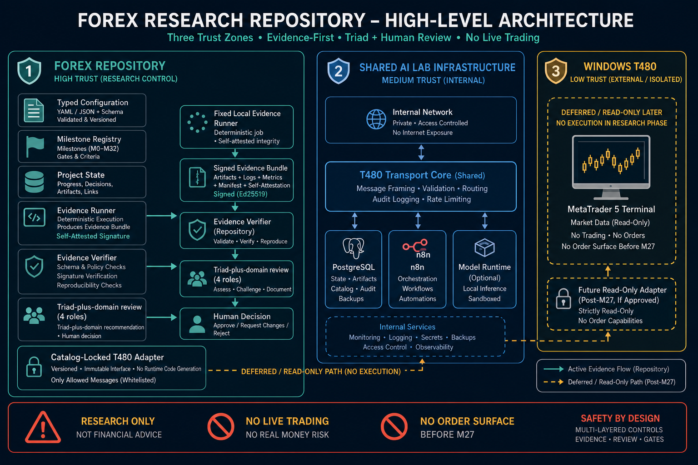
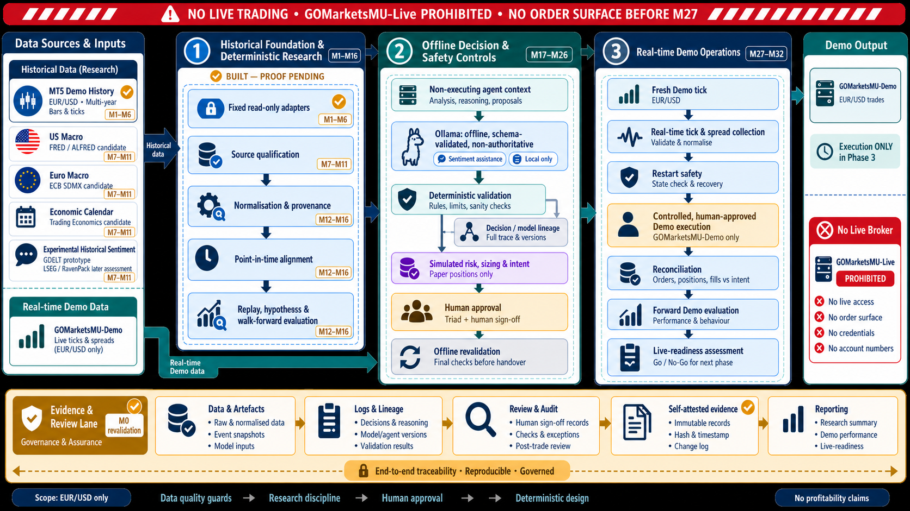

# Architecture

## High-level system diagram



## Historical market-intelligence roadmap



This diagram visualises the approved three-phase, historical-first roadmap. It
is a design overview, not evidence that any future adapter, source, Ollama
task, real-time feed, or Demo execution capability is deployed.

Amber ticks mean **built, but not proven**. They do not change milestone state:
M0 remains `NEEDS_REVALIDATION` and M1 remains blocked until that revalidation
is complete. All other phase components are planned.

### Component-to-milestone map

| Diagram component | Delivering milestones |
| --- | --- |
| Governance, evidence, review, self-attested integrity | M0 revalidation; required throughout M1–M32 |
| Demo historical export, fixed read-only bridge, persistence, multi-timeframe price data | M1–M6 |
| Source qualification and candidate macro/calendar/sentiment adapters | M7–M11 |
| Normalisation, provenance, point-in-time alignment, replay, deterministic hypotheses, one explainable offline ML baseline, walk-forward evaluation | M12–M16 |
| Non-executing context, bounded Ollama assistance, lineage, simulated risk/sizing/intent, approval and revalidation | M17–M26 |
| Fresh Demo tick, tick/spread collection, recovery safety | M27–M29 |
| Human-approved Demo execution and reconciliation | M30 |
| End-to-end comparison, forward Demo evaluation, live-readiness assessment | M31–M32 |

The diagram is a maintained overview of the intended ownership and trust
boundaries. It distinguishes the Forex repository, shared `cs-ai-lab-infra`,
and the Windows T480 / MetaTrader 5 environment. It also shows the evidence
path: the fixed local evidence runner self-attests a captured bundle; the
repository verifier checks its signature, schema, policy, and reproducibility;
then the four-role Triad-plus-domain review produces a recommendation for a
human decision.

This is an architecture map, not proof that a shared service or future
capability is currently deployed. The mutable execution record remains
`project_state.json`.

The roadmap is historical-first: closed MT5 Demo history supports the data and research layers through M16, offline shadow/risk/approval controls follow through M26, and fresh real-time Demo validation is deferred to M27–M32. Historical bars never substitute for a fresh tick, current spread, or execution proof.

The historical research layer will preserve source and availability timestamps,
revision lineage, source hashes, and dataset snapshots before aligning macro,
calendar, market-context, or sentiment observations with EUR/USD decisions.
This is necessary to prevent future leakage. Ollama, if adopted under M18, is
limited to fixed-version, offline, schema-constrained analysis of permitted
captured data; it has no transport, provider, MT5, or execution authority.

M15 adds one small, explainable ML baseline to the historical research layer.
It consumes only versioned, point-in-time-valid snapshots and produces
research probabilities plus a model card. M16 tests it chronologically against
no-change and deterministic baselines. It is not an autonomous strategy, does
not retrain online, and cannot create, approve, or execute orders.

The initial strategy shape is one EUR/USD intraday session: at a defined UTC
decision time the research layer returns `BUY`, `SELL`, or `NO_TRADE` with a
0–100 advisory score. A later Demo workflow may open at most one
human-approved position and must close it by the configured UTC cutoff or an
earlier predefined risk exit. The score is evidence for a human decision, not
an approval or execution instruction.

Target ownership boundary:

```text
cs-ai-lab-infra
  shared T480 transport, PostgreSQL, n8n, optional Ollama, internal network

Forex
  application configuration, read-only MT5 adapter, schemas, migrations,
  research logic, workflows, decisions, and evidence

Windows T480
  installed MetaTrader 5 terminal; later, the Forex-owned MT5 adapter
```

Capabilities are introduced vertically, one milestone at a time. Shared infrastructure is referenced rather than copied. Fixed safety invariants remain in schemas and code, even when related operator settings are visible in configuration.

The hard boundary remains: research only; no live trading, no
`GOMarketsMU-Live`, and no order surface before M27. Actual Demo execution is
separately gated at M30. The evidence signature is self-attested integrity,
not independent execution provenance.
