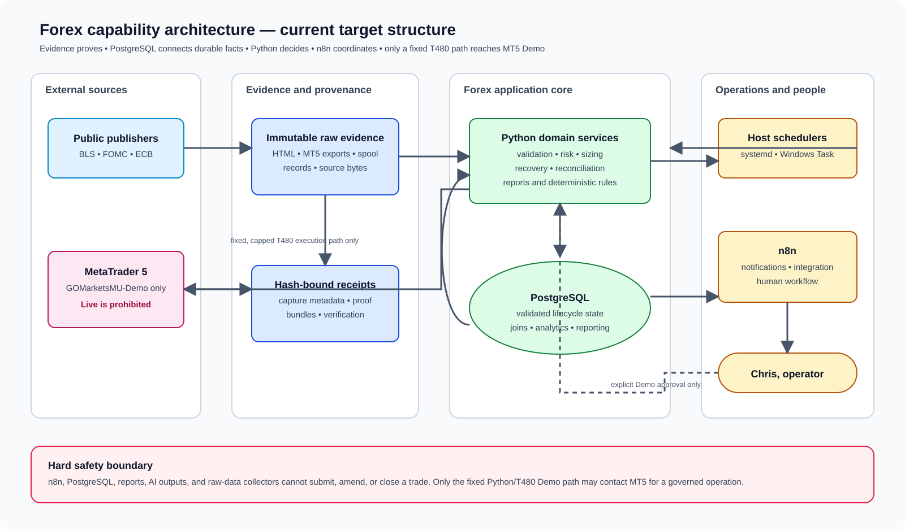
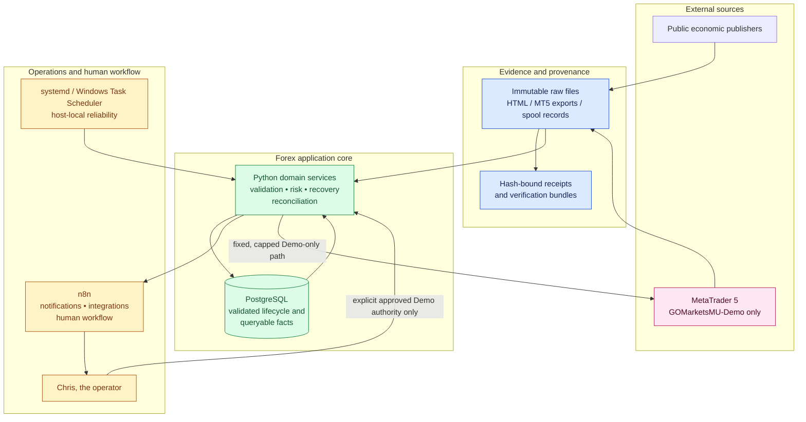

# Capability architecture

This document is the canonical map from a business capability to its owner,
data boundary and permitted runtime. It makes the existing system easier to
extend without changing the active M20 Demo path by accident.

## Rule of structure

Organise and assess a component first by the capability it delivers, then by
the runtime it needs. A file may support more than one capability only where
its interface is explicit and tested. No component receives broker authority
because it happens to run on T480, has PostgreSQL access, or is invoked by a
workflow.

## Product boundary: EUR/USD Demo MVP

The product is a **EUR/USD Demo decision-and-learning platform**. Its job is
not to collect every possible market feed, automate every operational task, or
prove a universal trading edge. Its job is to make a bounded, explainable
decision at a point in time, execute it only on the approved Demo account when
eligible, and learn from the resulting broker-recorded outcome.

The only product path that may drive a new entry is:

```text
closed EUR/USD market data + available economic context + active strategy/risk policy
    -> BUY / SELL / NO_TRADE decision
    -> protected GOMarketsMU-Demo execution or recorded refusal
    -> broker reconciliation and post-trade analysis
```

Each capability below has one responsibility and a narrow interface. A new
component must name the capability it belongs to; otherwise it is deferred.

The current evidence-based readiness assessment and update format are kept in
[Demo autonomy readiness scorecard](demo-autonomy-readiness.md).

| # | Product capability | Owns | Consumes | Produces | Must not do | MVP priority |
| --- | --- | --- | --- | --- | --- | --- |
| 1 | **Current market analysis** | Fresh EUR/USD quote, completed bars, spread and market regime inputs | MT5 Demo observations | Point-in-time market snapshot | Submit orders, infer missing bars, or rewrite broker data | Now |
| 2 | **Economic information** | Dated macro events, their source/availability and event-window context | Qualified public-source captures | Calendar context: clear, event-window, partial or unavailable | Invent event times, set position size, or submit orders | Now |
| 3 | **Strategy engine** | Versioned market hypotheses: regime, setup, direction candidate and technical invalidation/target logic | Point-in-time market snapshot and permitted contextual features | `BUY`/`SELL`/`NO_TRADE` *candidate* with strategy/version/rationale | Submit an order, set account limits, treat an event as directional fact, or alter itself from recent P&L | Now |
| 4 | **Decision engine** | Final decision by combining the candidate with calendar, risk, position and data-quality gates | Strategy candidate, market snapshot, calendar context and active risk inputs | A hash-bound final `BUY`/`SELL`/`NO_TRADE` proposal with rationale | Fetch data opportunistically, change policy, select a new strategy rule, or call MT5 directly | Now |
| 5 | **Risk and sizing** | Whether entry is permitted, stop/target validity, loss and exposure caps, and size within fixed limits | Final candidate, account/risk state and broker contract data | Permitted/refused proposal and protected trade parameters | Predict direction, enlarge limits from a confidence score, or override a refusal | Now |
| 6 | **Execution engine** | The fixed Demo-only order lifecycle | A persisted actionable proposal | MT5 submission result and monitored position state | Choose a strategy, alter a proposal, or access a Live account | Now |
| 7 | **Data and schema** | Canonical structured records and their lineage | Validated observations, decisions and broker outcomes | PostgreSQL lifecycle/query records linked to immutable evidence | Be the source of market truth or silently repair raw data | Now, only where required by 1–8 |
| 8 | **Post-trade analysis** | Reconciliation, realised P&L/costs, trade quality and strategy attribution | Broker history plus stored decision lineage | Honest outcome record and review metrics | Change an outcome, retroactively justify a trade, or submit a new order | Now |
| 9 | **Research and backtesting** | Reproducible strategy hypotheses and comparisons | Versioned historical datasets and outcome records | Advisory findings, candidate strategy/policy revisions | Trade, rewrite live records, or promote a hypothesis automatically | Next |
| 10 | **Operator operations** | Health, visibility, alerts and explicit Demo controls | Read-only product state | Status, reports and notifications | Make trading decisions or bypass the execution boundary | Supporting |

### High-level product requirements

These are outcome requirements for the components above. They define what
“ready for autonomous Demo operation” means; implementation choices may change
only if these outcomes and boundaries still hold.

| Capability | High-level requirement | Minimum Demo acceptance evidence |
| --- | --- | --- |
| Current market analysis | At each decision, provide a fresh EUR/USD bid/ask, spread and only completed M1 bars; expose H1/D1 inputs only after their own close and availability. All decision timestamps are UTC, with `Pacific/Auckland` displayed to the operator. | Retained MT5 Demo snapshot whose quote freshness, bar closure/availability and instrument/server identity independently validate. |
| Economic information | Provide the event families in scope with source URL, publisher bytes, capture time, exact scheduled time where declared, qualification/coverage state and point-in-time availability. Missing, partial or ambiguous data must remain explicit. | Hash-bound source receipts and raw bytes; a decision-time context report that rejects future/unqualified data. |
| Strategy engine | Evaluate one named, versioned strategy against point-in-time inputs and return a candidate `BUY`, `SELL` or `NO_TRADE`, with setup, regime, invalidation, stop/target logic and rationale. | Reproducible candidate from a retained snapshot; tests showing no look-ahead, no mutable rule change and correct `NO_TRADE` behaviour. |
| Decision engine | Combine the strategy candidate with data quality, calendar, risk and position gates to produce exactly one final, explainable proposal. A veto may only preserve/refuse a new entry; it cannot invent direction. | Hash-bound final proposal/snapshot showing every applied gate and its final action. |
| Risk and sizing | Refuse unsafe entry; otherwise calculate a fixed, bounded volume and broker-valid stop/target within per-trade, aggregate-loss, position and cost limits. A perceived edge, recent P&L or account reload must not expand initial caps. | Persisted proposal plus broker contract/risk inputs demonstrating each cap and protection check. |
| Execution engine | Submit only a persisted actionable EUR/USD proposal through the fixed approved Demo path once, attach broker-side protection, monitor the resulting position, and never contact a Live account. | Broker-confirmed Demo attempt/position record matched to proposal, idempotency key and protection values. |
| Data and schema | Keep immutable raw source/broker evidence separate from canonical PostgreSQL facts. Every decision and outcome must retain source IDs/hashes and be queryable without rewriting history. | Reconciled database lineage from raw input → snapshot → proposal → attempt → outcome. |
| Post-trade analysis | Reconcile broker history to every attempt; calculate realised P&L and costs from broker facts; attribute outcome to the exact strategy/version and gates used. Unknowns block new entries rather than being filled in. | Broker-derived closed outcome linked to its decision lineage, including reconciled costs and AUD P&L. |
| Research and backtesting | Evaluate versioned hypotheses on sealed historical data and retained Demo outcomes; distinguish research from current operating policy. | Reproducible experiment manifest, dataset lineage and results. No execution action is possible from this capability. |
| Operator operations | Make health, current scope, decisions, holds, failures, evidence locations and recovery status visible. Operator controls are explicit, narrow and auditable. | Status/report reflecting the actual listener/worker state and immutable evidence references; no hidden control path. |

### Cross-capability requirements

1. The only permitted execution target is `GOMarketsMU-Demo` for EUR/USD.
2. Every new entry has a single final `BUY`, `SELL` or `NO_TRADE` decision;
   `NO_TRADE` is a successful, recorded outcome when entry is not justified.
3. No component may infer missing market, calendar, broker, cost or position
   facts. Unknown inputs are represented explicitly.
4. All automated activity is reproducible from retained evidence and governed
   configuration; execution is additionally broker-reconciled.
5. Strategy changes are versioned hypotheses. They do not self-deploy or
   enlarge risk without an explicit operator-approved policy change.

### Capability gaps to close deliberately

These are capability blocks that make autonomous trading dependable. They are
listed to prevent hidden work, not to broaden the immediate product scope.

| Capability block | What it must do | Current position | Delivery priority |
| --- | --- | --- | --- |
| Strategy lifecycle governance | Keep a versioned record of rules, parameters, features, expected behaviour, approval, promotion, rollback and retirement. A challenger may be measured but cannot change production risk. | Partly represented in configuration and research artifacts; no single lifecycle register. | Before changing an operating strategy; lightweight version registry is sufficient for M1 Demo. |
| Market reference, session and clock service | State whether EUR/USD is tradable; account for market sessions, holidays, broker rollover, quote freshness, broker symbol/lot/pip/margin rules and clock health. Unknown or stale facts yield `NO_TRADE`. | Market snapshots exist; the authoritative reference and session contract is incomplete. | Before unattended M1 Demo operation. |
| Decision snapshot and data-quality contract | Assemble the exact point-in-time market, calendar, account, position and policy inputs used for a decision, including source freshness, revisions and missing-data semantics. | Partly present through audit records and calendar seam; not yet a single explicit contract. | Before relying on decision quality or analysing outcomes. |
| Portfolio and aggregate exposure controller | Enforce account-wide caps across M1 and H_SLOW: total loss/notional, concurrent positions, directional concentration and stream isolation. It may allow or refuse a proposal, never rewrite strategy intent. | M1 guards exist; shared cross-stream controller is not complete. | Required before H_SLOW activation; M1-only Demo can retain its current bounded scope. |
| Order and position lifecycle service | Maintain a broker-independent lifecycle for submitted, accepted, rejected, partially filled, filled, amended, closed and unknown orders; reconcile each transition and confirm protective orders. | M1 has bounded execution and reconciliation paths; a complete shared lifecycle and H_SLOW equivalent are missing. | M1: complete real-world proof. H_SLOW: required before activation. |
| Operational control plane | Provide scoped pause/resume/kill controls, release and rollback identity, health checks, alerting, recovery ownership and a clear safe state on uncertainty. | Partly present through contracts, queues and recovery work; needs a concise operating surface. | Before unattended M1 Demo operation. |
| Performance attribution and research governance | Measure each outcome against decision, regime, event context, spread/slippage and costs; track forward out-of-sample results and edge decay. This informs approved revisions, not automatic risk escalation. | Research and post-trade elements exist; unified attribution scorecard is incomplete. | Start during M1 Demo; mature after reliable reconciled sample exists. |
| AI advisory governance | If AI is used, retain model/prompt/data/version/evaluation lineage and enforce advisory-only output. AI has no broker credentials, order authority or ability to alter a risk policy. | Deliberately absent from the execution path. | Required before any AI output can influence a strategy review; not required for the initial deterministic M1 loop. |
| Security and account binding | Separate Demo identities per stream, keep secrets outside the repository, bind each worker to its approved terminal/account/symbol and prevent credentials or Live targets from entering logs or configuration. | M1 Demo boundary exists; dedicated H_SLOW terminal binding remains incomplete. | M1: maintain. H_SLOW: required before activation. |

The immediate critical path is therefore small: a fresh, broker-reconciled M1
operation; qualified point-in-time event coverage; an explicit market/session
and decision-snapshot contract; and an auditable M1 safe-control surface.
H_SLOW adds its dedicated terminal, full order/position lifecycle and shared
exposure control. AI-led research, broad portfolio functionality and automatic
strategy optimisation remain outside the initial Demo delivery.

### Explicit exclusions for this MVP

- Live trading, `GOMarketsMU-Live`, and real-money optimisation.
- Crypto, equities, indices, multi-broker routing and portfolio allocation.
- AI-generated orders or autonomous strategy changes.
- Generic workflow automation with order authority; n8n may notify and
  orchestrate bounded non-execution work only.
- New dashboards, collectors, databases or recovery mechanisms unless they
  directly unblock the product path above.

### Delivery rule

Work is accepted into the current delivery queue only if it does one of these:

1. supplies a missing input to the current decision;
2. makes the decision safely executable on Demo;
3. records/reconciles the resulting broker outcome; or
4. makes those three steps observable to the operator.

Everything else is recorded as a later capability, not worked ahead of the
critical path.

## Capability map

| Capability | Present components | System of record | Permitted runtime and authority |
| --- | --- | --- | --- |
| Governance and configuration | `milestone_registry.json`, `project_state.json`, `src/forex/milestones.py`, `src/forex/config/` | Registry/state plus append-only run history | Python CLI; no broker or generic remote-command authority. |
| Evidence and provenance | evidence runner, `src/forex/event_capture_store.py`, BLS capture records, M20 spool/mirror, `runs/evidence/` | Immutable raw files and hash-bound JSON receipts | Python and fixed read-only adapters; never repair or overwrite observed evidence. |
| Market and broker boundary | `t480/m20_demo_listener_service.py`, `t480/m20_demo_trading_session.py`, `scripts/t480_adapter.py` | MT5 Demo plus bound listener/audit records | Fixed T480 catalog only. `GOMarketsMU-Live` is prohibited. |
| M1 execution safety and recovery | M20 policy kernel, spool page/drain, listener/monitor, recovery tooling | Immutable assessment evidence plus PostgreSQL lifecycle facts | Python and Windows Scheduled Task; n8n has no role in execution or recovery. |
| Economic-event ingestion | BLS collector/scheduler, policy-calendar collector, event store, annotation sidecars | Immutable raw capture/receipt provenance plus PostgreSQL as the canonical queryable calendar record | Python/systemd today; n8n may operate a separately qualified, bounded public-source workflow. |
| Research and analytics | replay, regime, walk-forward, reports, dashboards | PostgreSQL projections with source/digest references | Python/SQL read paths; advisory only. |
| H_SLOW lifecycle | `h_slow_*` modules and `sql/h_slow_lifecycle.sql` | PostgreSQL lifecycle state and immutable input provenance | Disabled Python worker; distinct Demo scope; no activation without explicit mandate. |
| Integration automation | `n8n/`, `scripts/n8n_forex_adapter.py` | n8n execution history is operational metadata, not business truth | Fixed n8n workflow adapter; notifications, bounded integrations and human workflow only. |
| Host reliability | systemd renderers/services/timers and Windows Scheduled Task release protocol | Host manager state and hash-bound health evidence | systemd/Windows Task Scheduler; no business or broker decision logic. |
| AI-assisted research | research/ML/Ollama-adjacent modules and future workflows | Versioned research inputs and retained output provenance | Advisory/research only; cannot obtain or relay execution authority. |

## Data flow and storage rule





```text
External publisher or MT5 export/observation
  -> immutable raw bytes + receipt + digest        (proof)
  -> validated PostgreSQL projection               (durable queryable fact)
  -> Python domain logic / reconciliation / report (deterministic behavior)
  -> n8n notification or human workflow            (orchestration)
```

All structured calendar facts used by the application are projected to
PostgreSQL after validation: event time, source, qualification, availability,
revision and provenance references. Keep original publisher material outside
PostgreSQL as hash-bound immutable evidence; it is the replayable source record,
not a competing calendar database. Every calendar row must retain its source
ID, capture/observation ID and raw/receipt digest reference.

## Runtime selection rule

| Need | Default choice |
| --- | --- |
| Deterministic rule, safety gate, parser, recovery or reconciliation | Python |
| Always-on local service or short reliable host cadence | systemd or Windows Scheduled Task |
| Fixed access to MT5, T480-local n8n, or named database operation | T480 adapter catalog |
| Durable lifecycle, idempotency, joins and reports | PostgreSQL |
| Original input, evidence, proof or replayable receipt | Immutable files and JSON |
| API orchestration, alerts, notification or human review flow | n8n |
| Research inference or synthesis | AI advisory with retained provenance; never execution |

## Repository structure target

The present flat `src/forex/` module layout is retained while M29 is active.
New work should be grouped by capability in the following target structure;
adopt it gradually behind stable imports and tests rather than by a disruptive
move of the active listener path.

```text
src/forex/
  governance/       configuration, milestones, evidence contracts
  evidence/         capture, journal, retention, verification helpers
  execution/        M1/M20 policy, lifecycle, recovery, reconciliation
  events/           source qualification, collection, event context
  research/         replay, regimes, experiments, reporting
  h_slow/           isolated H_SLOW data, policy, lifecycle and worker
  integration/      n8n/T480-facing application adapters
  shared/           small stable utilities only

scripts/            thin, named operational entry points only
deploy/             service/timer templates and renderers
n8n/                versioned workflow definitions only
sql/                versioned migrations and named read models only
docs/architecture/  current topology, capability map and runbooks
```

## Adoption order

1. Treat this map as the classification rule for all new work now.
2. Add a schedule/service registry covering systemd, Windows tasks and n8n.
3. Add validated SQL projections for event, M1 decision and MT5-reconciliation
   analysis; retain raw inputs independently.
4. Add n8n only for reporting, notification and qualified non-execution
   integrations.
5. Refactor Python modules into capability packages only when a touched area is
   already covered by tests and its stable entry points can remain unchanged.

This is a structural roadmap, not a claim that the listed capabilities are all
deployed or formally proven. The current milestone contract and safety rules
remain controlling.
