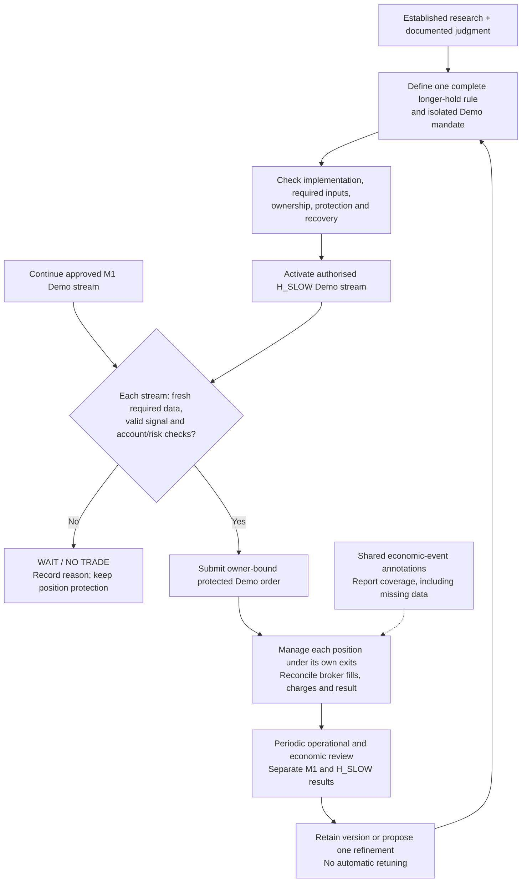

# EUR/USD: research-to-Demo workflow

Saved at Chris's request on 2026-09-12. This documents the proposed workflow;
it does not activate a strategy, change a trading mandate, or prove a milestone.

Updated delivery direction: [parallel Demo streams](parallel-demo-streams.md).
Chris selected continued M1 Demo operation plus a separate longer-hold stream.
The [shared wave guide](prompts/demo-income-waves.md) and
[Wave 3](prompts/demo-income-wave-3.md) now implement this planning direction.
Operational correctness and the applicable Demo mandate remain required;
profitability evidence is not a prerequisite to a bounded Demo hypothesis trial.

EUR/USD is the number of US dollars per euro. BUY EUR/USD buys euros and sells
dollars; a rising quote benefits that position before costs. SELL EUR/USD sells
euros and buys dollars; a falling quote benefits that position before costs.

## Workflow

The feedback arrow requires an explicit versioned decision, not automatic
retuning. Optional replay/shadow checks can help find implementation errors;
a historical profitability result or fixed shadow duration is not required.
Economic annotations do not change entry permissions unless a separate
versioned event rule has been activated.

## Deferred example: an optional US inflation entry filter

This is an example for later refinement, not the initial operating policy.
The initial event layer only annotates observations and never claims missing
calendar coverage is healthy. No 30-minute blackout is activated by this plan.

These times are examples, not a claim about any scheduled CPI release.

| Moment | Information available | Proposed behavior |
| --- | --- | --- |
| Before trading | Qualified calendar says US CPI is due at 12:30 UTC | Mark the proposed 12:00–13:00 event window |
| 11:55 | Strategy signals BUY, with a possible ten-minute holding period | Wait: the holding period overlaps the event window |
| 12:30 | CPI is released | Continue the restriction; record the release when actually received |
| 13:01 | Event window has ended | Recheck fresh prices, spread, calendar health, other events and strategy |
| Valid new signal | BUY or SELL passes all risk and cost checks | Submit one protected Demo order |
| After exit | Broker confirms fills, charges and outcome | Record the actual net result for evaluation |

The initial 30-minute window is a predefined research setting, not a proven
optimal duration. Check the planned holding interval as well as entry time.
Required missing or stale calendar coverage prevents new entries once the
policy is activated. Existing position protection continues under its own rules.

The calendar initially determines entry eligibility; the tested strategy
determines direction. Increased US inflation does not automatically mean
SELL EUR/USD. Later research can evaluate actual values versus expectations
recorded before release, at a declared horizon and after attainable costs.
Each value needs its own units, reference period, source and availability time.

## Reuse published knowledge to reduce the work

Begin from an inspected published rule and its documented market, horizon,
data and cost assumptions. Register local adaptations before evaluating them.
Use existing engineering patterns for persistence, time handling, replay,
execution and risk; no broad search for new indicators is needed.

Time-series momentum research finds return persistence across a diversified
set of futures and forwards over one-to-twelve-month horizons. That provides
a research lead, but does not validate this repo's six-to-ten-minute EUR/USD
policy: [Moskowitz, Ooi and Pedersen](https://www.aqr.com/Insights/Research/Journal-Article/Time-Series-Momentum).
Announcement research finds exchange-rate responses to surprises, but does
not prove that a 30-minute event filter improves this strategy's net results:
[Andersen et al.](https://www.nber.org/papers/w8959).

Keep local validation bounded: confirm implementation matches the declared
rule and required inputs, then observe the authorised Demo execution. Use
historical comparisons when they answer a specific question; an untouched
evaluation interval is useful for a later economic claim, not mandatory before
the first Demo order. Preserve unknowns and uncertainty rather than extending
evaluation repeatedly until a profitable interval appears.

The optional event-filter experiment remains a deferred refinement.
No model has privileged knowledge of a currently profitable version for this
account. Published evidence helps select what to test and what to defer; local
observations determine whether the chosen implementation merits operation.

## Relationship to the repository

Parts of the strategy, risk, Demo execution and reconciliation paths exist.
The maintained event feed is planned as annotation-only initially; any later
influence on entry decisions is a separate versioned refinement.
Market closures permit event ingestion development and historical comparison;
fresh Demo execution retains the parked proof requirements. The event module
starts in this repository with a reusable, broker-independent interface.

- [Economic-event layer review](reviews/forex-economic-event-layer-review.md)
- [Return-improvement approach and proposed experiments](reviews/forex-return-improvement-approach.md)
- [Wave 3 parallel Demo delivery plan](prompts/demo-income-wave-3.md)

H_EVENT and H_SESSION are deferred refinements under the revised Wave 3 plan.
The initial two streams are M1 and H_SLOW. This workflow does not add another
simultaneous strategy search or grant Live authority.
