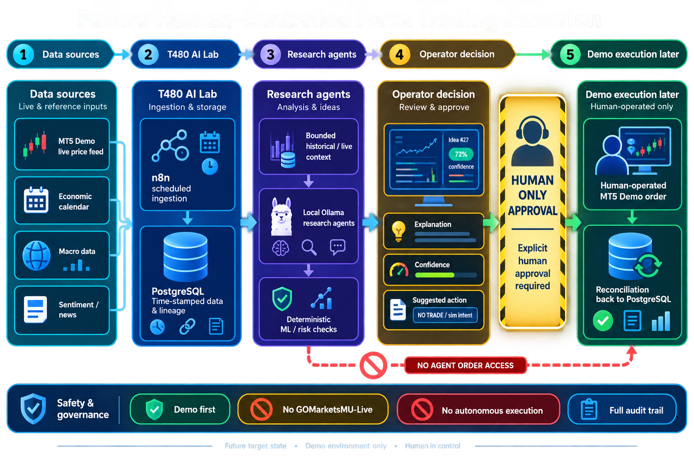
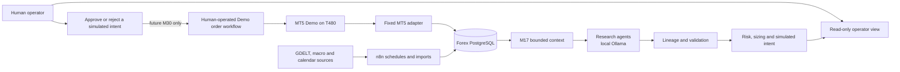

# Future user journey — plain-English view

This describes where the project is heading. It is **not** saying that live trading or autonomous execution exists today. Today we are building an offline research system. Real-time Demo validation begins at M27, and a human-operated Demo action is not considered until M30.

## The simple picture

```text
Market and research data
        ↓
T480 stores it safely in PostgreSQL
        ↓
Research agents analyse a limited, safe view of it
        ↓
The system explains a simulated idea: BUY / SELL / NO TRADE
        ↓
You inspect it and decide what to do
        ↓
Much later: you may manually carry out one approved Demo action
```

The important rule is simple: **agents analyse; you decide; only you can ever carry out a future Demo action.**



## What you will do

1. Open a simple read-only view of the data and research result.
2. See whether data is fresh and what the research agents considered.
3. Read a plain explanation and confidence/uncertainty, including `NO_TRADE` when there is no good basis for action.
4. Review the system's simulated risk and sizing checks.
5. Decide to do nothing, keep researching, or—only after the later Demo milestones—manually approve a constrained Demo action.

## What the system does for you

- **n8n** regularly brings in historical and context data.
- **PostgreSQL** keeps the data, timestamps, and lineage so results can be checked later.
- **Python safety rules** ensure agents see only data that would have been available at the stated time.
- **Local Ollama agents** provide research assistance, not trading control.
- **Risk and approval controls** turn any later suggestion into a simulated, reviewable intent—not an order.

## What it never does

- It does not access `GOMarketsMU-Live`.
- It does not let an agent place an order.
- It does not hide its inputs, uncertainty, or reasons.
- It does not turn a historical result into a claim that future trading will work.

## Technical reference flow



## Operator journey

1. **Observe.** Open the read-only dashboard and inspect current data freshness, historical context, model output, risk checks, and provenance.
2. **Research.** Local research agents receive only the M17 bounded context. They may return structured analysis or `ABSTAIN`; they cannot access accounts, MT5 controls, or an order surface.
3. **Validate.** Deterministic validation, lineage, event-quality, risk, and sizing controls test the result before any intent is shown.
4. **Decide.** The operator sees a simulated `BUY`, `SELL`, or `NO_TRADE` intent with inputs, uncertainty, and refusal reasons. Until M30 it remains simulation only.
5. **Future Demo execution.** After M27–M29 prove live Demo data, tick/spread controls, and recovery safety, the operator may explicitly approve a single Demo action under M30. The human—not an agent—operates the execution workflow.
6. **Reconcile.** The result is captured back to PostgreSQL with lineage and shown in the operator view for review.

## Component ownership

| Component | Purpose | Runtime/owner |
| --- | --- | --- |
| n8n | Scheduled collection and import only | T480, shared platform |
| PostgreSQL | Historical, context, lineage and audit records | T480, shared platform; Forex schema |
| Forex Python | Contracts, feature/risk logic, fixed adapters | Forex repository |
| Local Ollama | Bounded research analysis only | T480, M18 onward |
| MT5 Demo | Historical export now; fresh Demo observations in M27+ | T480 |
| Human operator | Approval and any future Demo action | Human-only |

## Delivery position

- **Current:** historical data, n8n collection, PostgreSQL, M17 bounded context, and research-only ML foundations.
- **Next:** local Ollama analysis, lineage, evaluation, event quality, simulated risk/sizing/intent and human approval (M18–M26).
- **Later:** real-time Demo data/recovery proof and a human-operated Demo workflow (M27–M32).
- **Excluded:** live-broker access, autonomous execution, and `GOMarketsMU-Live`.
