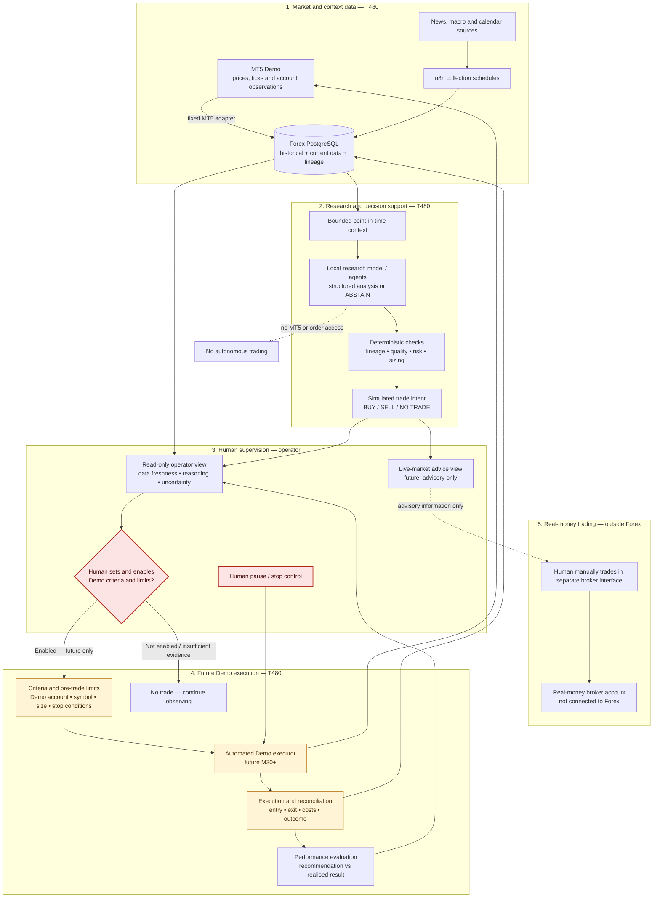

# Future user journey — plain-English view

This describes where the project is heading. It is **not** saying that real-money live trading or autonomous execution exists today. Today we are building an offline research system. The project deliberately grows into a controlled **automated Demo execution and performance-learning loop**: pre-set criteria enable the project to send constrained trades to MT5 Demo using live market prices, while a human supervises, manages and can stop that automation. The outcome returns to PostgreSQL for evaluation. Later, the same system can show **live-market advice** to the human, but the human alone manually executes any real-money trade in a separate broker interface. Real-time Demo validation begins at M27 and controlled Demo execution is planned from M30.

## The simple picture

```text
Market and research data
        ↓
T480 stores it safely in PostgreSQL
        ↓
Research agents analyse a limited, safe view of it
        ↓
The system evaluates pre-set criteria: BUY / SELL / NO TRADE
        ↓
You inspect, supervise and can stop it
        ↓
Much later: it may automate constrained Demo trades and give you live-market advice
```

The important rule is simple: **the project may execute bounded Demo trades when approved criteria are met; it may advise you about live markets; you alone execute any real-money trade outside the project.**


## What you will do

1. Open a simple read-only view of the data and research result.
2. See whether data is fresh and what the research agents considered.
3. Read a plain explanation and confidence/uncertainty, including `NO_TRADE` when there is no good basis for action.
4. Review the system's simulated risk and sizing checks.
5. Set or approve the constrained Demo criteria, then supervise, pause or stop the later Demo automation.
6. Inspect the recorded entry, exit, costs, slippage and realised result, then judge whether the analysis was useful.
7. If you choose to trade real money later, read the system's live-market advice and manually use your separate broker interface; the project cannot execute that trade.

## What the system does for you

- **n8n** regularly brings in historical and context data.
- **PostgreSQL** keeps the data, timestamps, and lineage so results can be checked later.
- **Python safety rules** ensure agents see only data that would have been available at the stated time.
- **Local Ollama agents** provide research assistance, not trading control.
- **Risk and criteria controls** turn a later suggestion into a constrained, reviewable Demo instruction.
- **The Demo execution and reconciliation loop** records what actually happened, so the operator can compare the recommendation with the result.

## What it never does

- It does not access `GOMarketsMU-Live`.
- It does not let a research model or general-purpose agent place an order.
- It does not permit an unconstrained or real-money order path.
- It does not hide its inputs, uncertainty, or reasons.
- It does not turn a historical result into a claim that future trading will work.

## Future Demo-trading operating architecture

This is the **Demo trading function we are building towards**, not a diagram of
the repository. Solid lines describe the intended future Demo path; the red
criteria gate prevents unconstrained execution. The project owns the closed
Demo loop, including result capture and performance evaluation. Components
labelled *future* are not deployed or authorised today. Real-money live
accounts are deliberately outside this system.



### The control rule

```text
Agent or model:      researches and may recommend NO TRADE
System controls:     validate data against fixed Demo criteria and limits
Human operator:      enables, supervises, pauses or stops Demo automation;
                     manually executes any real-money trade outside Forex
Project execution:   sends only criteria-matched, limit-checked Demo actions
MT5 Demo:            returns the trade result for reconciliation and evaluation
Live-market advice:  advisory information only; never an order
Real-money account:  human-managed outside this project; never connected
```

## Operator journey

1. **Observe.** Open the read-only dashboard and inspect current data freshness, historical context, model output, risk checks, and provenance.
2. **Research.** Local research agents receive only the M17 bounded context. They may return structured analysis or `ABSTAIN`; they cannot access accounts, MT5 controls, or an order surface.
3. **Validate.** Deterministic validation, lineage, event-quality, risk, and sizing controls test the result before any intent is shown.
4. **Set and supervise.** The operator sees a simulated `BUY`, `SELL`, or `NO_TRADE` intent with inputs, uncertainty, and refusal reasons. Before any Demo automation, the operator explicitly enables bounded criteria and limits. Until M30 it remains simulation only.
5. **Future automated Demo execution.** After M27–M29 prove fresh Demo data, tick/spread controls, and recovery safety, the project may execute criteria-matched Demo trades under M30. It can never route to a real-money account. The operator can pause or stop the automation.
6. **Reconcile and learn.** The project captures entry, exit, costs, slippage and realised result back to PostgreSQL. The operator compares the intent and result to evaluate whether the analysis engine is helping. This is evaluation evidence, not a guarantee of profitability.
7. **Later live-market advice.** The system may show advice based on live-market data, with its reasons and uncertainty. If the operator chooses to make a real-money trade, they do so manually in a separate broker application. Forex has no live-account credentials, connectivity or order capability.

## Component ownership

| Component | Purpose | Runtime/owner |
| --- | --- | --- |
| n8n | Scheduled collection and import only | T480, shared platform |
| PostgreSQL | Historical, context, lineage and audit records | T480, shared platform; Forex schema |
| Forex Python | Contracts, feature/risk logic, fixed adapters | Forex repository |
| Local Ollama | Bounded research analysis only | T480, M18 onward |
| MT5 Demo | Historical export now; fresh Demo observations in M27+ | T480 |
| Controlled Demo executor | Sends criteria-matched, limit-checked Demo instructions and captures results | T480, future M30+ |
| Live-market advice view | Shows research advice and uncertainty; cannot create an order | T480, future advisory capability |
| Human operator | Enables criteria, supervises/pause-stops Demo automation; manually executes any real-money trade outside Forex | Human-only |

## Delivery position

- **Current:** historical data, n8n collection, PostgreSQL, M17 bounded context, and research-only ML foundations.
- **Next:** local Ollama analysis, lineage, evaluation, event quality, simulated risk/sizing/intent and human approval (M18–M26).
- **Later:** real-time Demo data/recovery proof, controlled Demo execution, reconciliation and performance evaluation (M27–M32).
- **Excluded:** real-money broker access and `GOMarketsMU-Live`. Automated execution is limited to the future, criteria-bounded MT5 Demo path; any future live-market advice remains advisory-only.
