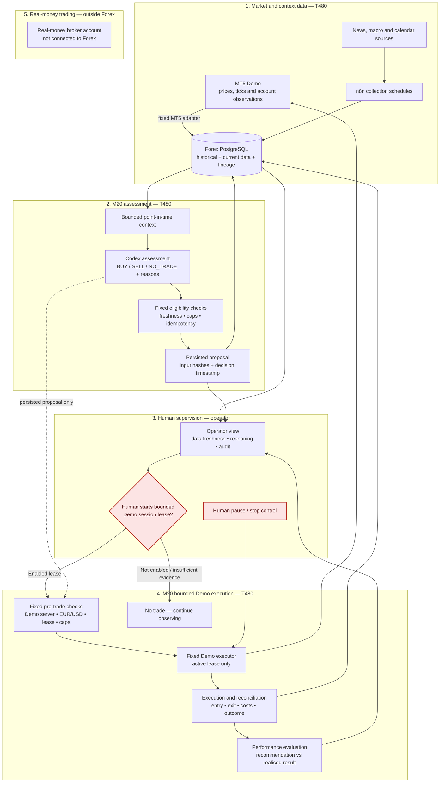

# Future user journey — plain-English view

This describes the M20 MVP target. It is **not** saying that real-money live
trading exists today or will be enabled by this project. A human starts a
bounded `GOMarketsMU-Demo` session. During that lease, Codex assesses fresh
EUR/USD market data, records a proposal and reasons, and a fixed Demo-only
executor may submit an eligible trade. PostgreSQL retains the data, proposal,
execution events, and outcome for back-testing. The human supervises and can
pause or stop the session at any time. `GOMarketsMU-Live` remains outside the
system.

## The simple picture

```text
Fresh Demo bid / ask / spread + completed M1 candles
        ↓
T480 assessment every 10 seconds: BUY / SELL / NO_TRADE
        ↓
Persisted proposal, rationale and input hashes in PostgreSQL
        ↓
Human-enabled bounded session lease
        ↓
Fixed Demo executor or recorded NO_TRADE/refusal
        ↓
Position monitoring, reconciliation and back-testing record
```

The important rule is simple: **the project may execute only a bounded,
recorded `GOMarketsMU-Demo` trade during an active human-enabled lease. It
never accesses, advises execution on, or routes an order to a real-money
account.**


## What you will do

1. Start a Demo session with a maximum number of trades and short expiry. The
   initial M20 contract fixes this at ten trades in sixty minutes, one open
   position, USD 10,000 notional per trade, USD 100,000 cumulative notional,
   and AUD 100 theoretical loss per trade.
2. Inspect the fresh data, the M1/M5 assessment, and the proposed `BUY`,
   `SELL`, or `NO_TRADE` with reasons and decision inputs.
3. Supervise, pause, or stop the session. An expired session cannot trade.
4. Inspect the recorded entry, exit, costs, slippage and realised result, then
   compare the proposal with the outcome during back-testing.

## What the system does for you

- **n8n** regularly brings in historical and context data.
- **PostgreSQL** keeps the data, timestamps, and lineage so results can be checked later.
- **Python safety rules** ensure agents see only data that would have been available at the stated time.
- **The M20 assessment component** runs every ten seconds and turns fresh M1
  data into a versioned
  `BUY`, `SELL`, or `NO_TRADE` proposal with reasons; its inputs are retained.
- **The session controls and fixed Demo executor** admit only eligible,
  cap-compliant proposals during the active lease.
- **The Demo execution and reconciliation loop** records what actually
  happened, so the operator can compare the proposal with the result.

## What it never does

- It does not access `GOMarketsMU-Live`.
- It does not provide a general-purpose agent, shell, MT5, account, symbol, or
  order interface.
- It does not permit an unconstrained, expired, unrecorded, or real-money
  order path.
- It does not hide its inputs, uncertainty, or reasons.
- It does not turn a historical result into a claim that future trading will work.

## Future Demo-trading operating architecture

This is the **M20 Demo trading function to be proven**, not evidence that it
is deployed today. Solid lines describe the bounded Demo path; the session
lease and fixed checks prevent unconstrained execution. The project owns the
closed Demo loop, including result capture and performance evaluation.
Real-money accounts are deliberately outside this system.



### The control rule

```text
Codex assessment:    records BUY / SELL / NO_TRADE with reasons and input hashes
System controls:     validate fresh data, fixed Demo criteria, session lease and caps
Human operator:      starts, supervises, pauses or stops the Demo session
Project execution:   sends only a persisted, criteria-matched, limit-checked Demo action
MT5 Demo:            returns the trade result for reconciliation and evaluation
Real-money account:  human-managed outside this project; never connected
```

## Operator journey

1. **Start.** The operator enables a short, capped Demo session. The lease is
   visible, expires automatically, and can be paused or stopped.
2. **Observe.** The system checks fresh bid/ask/spread and completed M1
   candles every ten seconds. The T16 dashboard shows the latest decision and
   human-readable candle checks; it has no trading controls.
3. **Assess.** Codex records a `BUY`, `SELL`, or `NO_TRADE` proposal with its
   reasons, decision time, and input hashes. A proposal is immutable once
   persisted.
4. **Execute or refuse.** The fixed executor acts only if the server,
   proposal, lease, position limit, and caps all pass. Otherwise it records a
   refusal or `NO_TRADE`; it never falls back to a different broker route.
5. **Monitor.** The project records position events, entry, exit, costs,
   slippage, and realised result while the operator supervises.
6. **Reconcile and learn.** PostgreSQL links the snapshot, proposal,
   execution, lifecycle, and outcome so the operator can back-test and
   evaluate the strategy. This is evidence, not a guarantee of profitability.

## Component ownership

| Component | Purpose | Runtime/owner |
| --- | --- | --- |
| n8n | Scheduled collection and import only | T480, shared platform |
| PostgreSQL | Historical, context, lineage and audit records | T480, shared platform; Forex schema |
| Forex Python | Contracts, feature/risk logic, fixed adapters | Forex repository |
| M20 assessment | Every 10 seconds, produces a persisted `BUY` / `SELL` / `NO_TRADE` proposal from fresh pricing and completed M1 candles | Forex repository, T480 |
| MT5 Demo | Fresh Demo data and bounded M20 actions only | T480, `GOMarketsMU-Demo` only |
| Fixed Demo executor | Sends an eligible, lease- and cap-checked Demo action and captures result events | Forex repository, T480, M20 target |
| Human operator | Starts a bounded session; supervises and pause-stops Demo automation | Human-only |

## Delivery position

- **Current contract:** M20 is the active target: fresh Demo data, a recorded
  assessment, bounded execution, monitoring, and PostgreSQL reconciliation.
- **Later:** M21–M32 add event quality, richer controls, recovery hardening,
  and broader forward evaluation.
- **Excluded:** real-money broker access and `GOMarketsMU-Live`. Any Demo
  action remains limited to the fixed, session-capped M20 path; the project
  never gains a live-account credential, connection, or order route.
