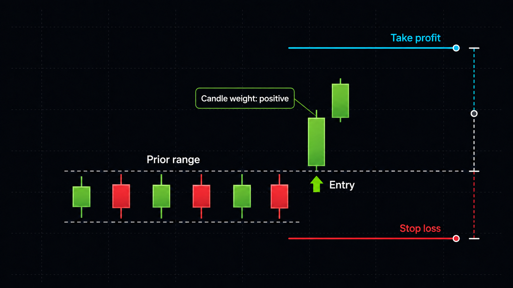
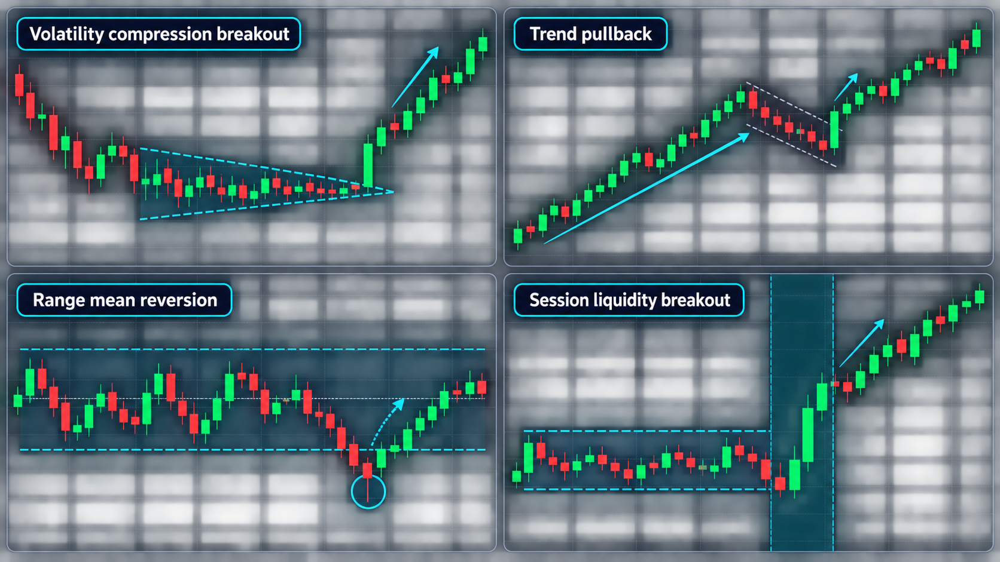

# M1 Demo trading strategy

## Purpose and scope

This is the first strategy playbook for the Forex MVP.  It governs a
**Demo-only** EUR/USD M1 execution experiment on `GOMarketsMU-Demo`; it is not
investment advice and makes no promise of a positive return.  Its purpose is
to produce comparable, cost-aware observations that can be tested before a
strategy is adopted or extended to M5 and other timeframes.

The execution boundary remains fixed:

- no live account or `GOMarketsMU-Live` access;
- at most one open EUR/USD position;
- a bounded session of at most ten trades in sixty minutes;
- maximum USD 10,000 notional per trade and USD 100,000 cumulative notional;
- a broker-side protective stop whose maximum theoretical loss is AUD 100;
- every proposal, execution attempt, position event, and closed P&L outcome
  is retained in PostgreSQL.

The live tick listener is transient: it observes MT5 refreshes in memory,
chooses a safe polling interval from those observations, and does not retain a
tick stream.  Decisions use only completed M1 candles and a fresh bid/ask;
the current candle is never a signal input.

## Initial strategy: closed-candle momentum breakout

This is the strategy to implement and measure first.  It is intentionally
simple enough to audit.

**How to read the image:** the small alternating candles form the prior M1
range.  The two green candles breaking above it form the momentum confirmation.
The green arrow is the potential entry.  The red line is the protective stop
below the range; the blue line is the initial 1.5R target.  A sell setup is the
same image inverted: two bearish candles break below the range, with the stop
above and target below.

### Entry conditions

On each newly closed M1 candle, create a proposal only when all of the
following are true:

1. The final two completed M1 candles close in the same direction.
2. The current close breaks the highest high (for a buy) or lowest low (for a
   sell) of the preceding five completed M1 candles.
3. The combined movement of those two candles is greater than the current
   bid/ask spread.  Otherwise the expected move is too small relative to the
   immediate cost.
4. The tick is fresh, the observed spread is within the configured operating
   limit, the Demo session lease is active, and no EUR/USD position is open.
5. The available target, before the next evident M1 support/resistance area,
   is at least 1.25 times the proposed risk.  If it is not, record
   `NO_TRADE`.

`BUY` entries use the current ask; `SELL` entries use the current bid.  The
proposal is persisted before an order can be sent and expires promptly if the
market has moved on.

### Plain-English assessment table

| What the listener checks | What it means in normal language | `BUY` needs | `SELL` needs | If it fails |
| --- | --- | --- | --- | --- |
| Two candles point the same way | The last two completed one-minute candles agree on direction. | Both closed higher than they opened. | Both closed lower than they opened. | `NO_TRADE` — momentum is mixed. |
| Breakout of the recent range | The latest close has escaped the range made by the five candles before it. | Closes above the prior five-candle high. | Closes below the prior five-candle low. | `NO_TRADE` — price is still inside the range. |
| Movement pays for spread | The combined move of the two candles is larger than the immediate bid/ask cost. | Upward combined move exceeds spread. | Downward combined move exceeds spread. | `NO_TRADE` — expected move is too small. |
| Fresh, tradeable market | The quote is current and the bounded Demo session can safely act. | Fresh ask, active lease, no open EUR/USD position. | Fresh bid, active lease, no open EUR/USD position. | `NO_TRADE` — operating condition is not safe. |
| Enough room for target | There is enough space before nearby support/resistance to justify the risk. | At least 1.25R above entry. | At least 1.25R below entry. | `NO_TRADE` — reward is too small. |

The live dashboard labels each row as a pass or fail using `Direction`,
`Breakout above / below`, and `Exceeds spread`.

### Stop loss and take profit

For a buy, the technical stop is just below the lowest low of the recent
five-candle setup.  For a sell, it is just above the highest high.  The
executor must then apply the hard AUD 100 loss limit using the broker's tick
size, tick value, minimum volume, and permitted price increments.

The actual stop is the closer-to-entry of the technical stop and the
AUD-100-capped stop.  If the technical setup needs more than AUD 100 of risk,
or the broker's minimum increment alone would exceed the cap, the result is
`NO_TRADE`.

Initial take profit is 1.5R, where `R` is the distance from entry to the
actual stop.  It is reduced to the nearest credible M1 support/resistance
level.  The trade is refused when that reduced target is below 1.25R.  Both
SL and TP must be set with the broker at submission time, so an interruption
of the listener cannot leave the position unprotected.

## Open-position state and exit management

An accepted order remains open.  PostgreSQL stores a current position record
and append-only lifecycle events; MT5 remains the source of truth for whether
the order is actually open, modified, or closed.

At every completed M1 candle, the monitor reconciles its saved position state
against MT5 and applies these rules:

- **At +1R:** request a broker-side stop modification to breakeven (entry,
  with the broker's allowed price increment applied conservatively).
- **At take profit or stop loss:** MT5 closes the position.  Reconcile the
  closed deal, record realised AUD P&L, and write the immutable outcome.
- **Momentum failure:** close at market after two consecutive completed M1
  candles in the direction opposite to the position.
- **Time stop:** close at market after ten completed M1 candles if neither
  protective level has been reached.
- **Operational uncertainty:** if a fresh MT5 position read or reconciliation
  fails, do not submit another order or an unverified close.  Keep the
  broker-side SL/TP in force, mark the state for recovery, and retry
  reconciliation.

Every exit must preserve the original rationale, entry, SL/TP, modifications,
exit reason, realised P&L, and reconciliation result.  A restart therefore
resumes by reading MT5 and the durable position state rather than assuming the
previous process's memory is correct.

## Fee and execution-cost ledger

The ledger records the broker-reported gross price P&L, commission, and swap
separately from the broker-reported net realised P&L.  It also records an
estimated spread cost and signed slippage cost using the actual fill relative
to the persisted proposed entry or exit.  The all-in estimated cost is:

`estimated spread cost + slippage cost - commission - swap`

Broker commission and swap values are normally negative charges, so subtracting
them converts charges into positive costs; a credit or price improvement can
reduce the total.  This cost measure is an analytic attribution and must not
be subtracted from realised P&L again—the broker's realised P&L already
contains the economic effects of the fills, commission, and swap.

Rows captured before this cost schema are labelled `UNAVAILABLE`, rather than
being backfilled with assumptions.  New closed trades are `RECORDED` only when
every component is supplied from the MT5 deal history and fixed decision
snapshot.

## Candidate strategies to test next

These are hypotheses, not production strategies.  Each uses the same session,
risk, ledger, and reconciliation controls above.

The visual patterns are filters for a trade proposal, not guarantees that a
trade should be placed.  Every one still needs the same spread, session-cap,
one-position, stop-loss, take-profit, and post-cost validation rules.

| Test order | Strategy | Simple entry idea | Simple exit idea |
| --- | --- | --- | --- |
| 1 — current | Momentum breakout | Two one-minute candles agree, then price closes outside the recent five-minute range. | Aim for 1.5 times the risk; exit if two candles reverse or after ten minutes. |
| 2 — next | Compression breakout | Price has been unusually quiet, then starts moving strongly out of that small range. | Stop on the far side of the quiet range. |
| 3 — next | Trend pullback | A short trend pauses, then resumes in its original direction. | Stop beyond the pullback low/high. |
| 4 — next | Range reversion | Price rejects the top or bottom of a well-defined quiet range. | Take profit near the middle; stop outside the range. |
| 5 — next | Session breakout | A small range breaks during a liquid market period when spread is normal. | Exit if price returns inside the range or at the planned R target. |

Only one strategy version may be active in a Demo session.  The strategy
identifier and every parameter used must be part of each decision snapshot,
so results cannot be mixed or reinterpreted later.

## How a strategy earns promotion

Run each candidate on the same Demo conditions for at least 100 closed trades
where practical.  Evaluate chronological out-of-sample batches rather than
choosing settings from the same observations used to design them.  Record and
compare:

- expectancy in R and in AUD per closed trade;
- win rate, average win, average loss, and profit factor;
- realised spread and slippage versus the proposed entry;
- maximum drawdown, consecutive losses, and time in market;
- the number and reason for `NO_TRADE` decisions.

A strategy is not promoted merely because it wins a short run.  It must have
positive post-cost expectancy, stay within the loss and session limits, and
remain positive in a later, separately observed batch.  Short-horizon
strategies are particularly sensitive to transaction costs and execution
speed; this is why the ledger measures realised outcomes rather than relying
on candle-only backtests.

## Extension path: M5 and beyond

M5 is a separate strategy version, not an automatic change to M1.  Before
adding it, create a dedicated playbook that specifies its completed-candle
inputs, entry, stop, target, monitoring cadence, time stop, and promotion
criteria.  The first extension should use the same durable position state and
ledger, while separating results by `selected_timeframe` and strategy version.

Higher timeframes may act as a research filter only after their data lineage
and decision schema are explicitly added.  They must not silently alter the
M1 strategy's signals or make an M1 result look comparable to an M5 result.
