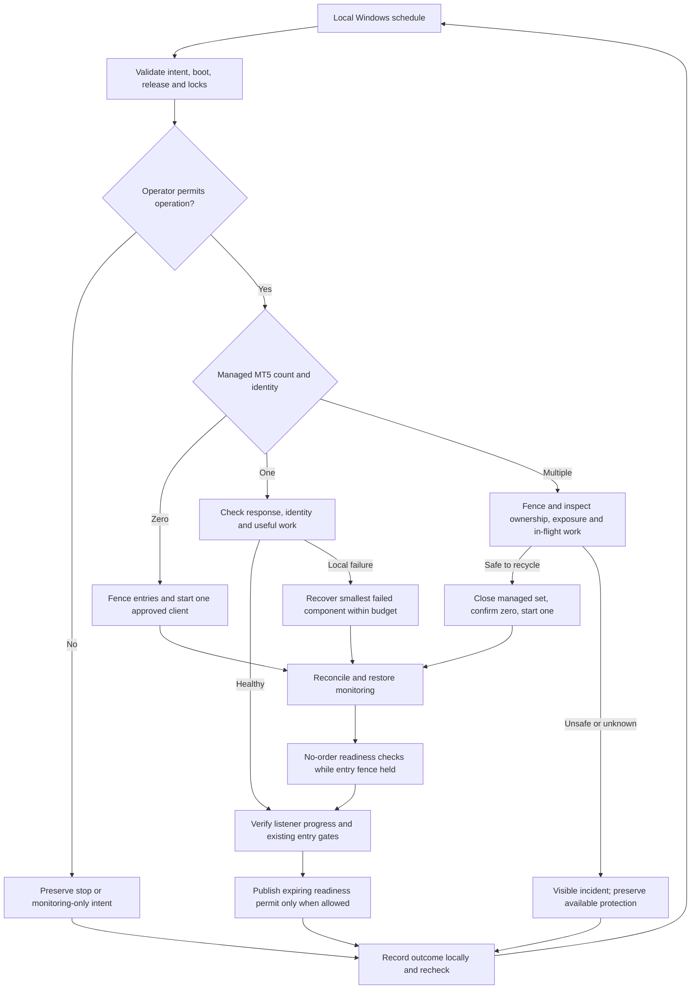

# Make T480 trading health and recovery independent of T16

This living ExecPlan follows `PLANS.md`. Status: **EXECUTION AUTHORISED;
M33.1 FEASIBILITY IN PROGRESS**. Following design review and registration of
M33.1-M33.4, Chris instructed execution. Begin with no-order runtime feasibility;
subsequent waves require their predecessor gates. Existing Demo account/risk
controls remain binding. Automatic sign-in still requires a specific credential
and security decision. No formal closeout or Git publication is authorised.

## Purpose / Big Picture

After implementation and proof, the T480 will check and recover its own approved
Demo trading runtime without T16, SSH polling, a browser, or an AI agent being
connected. If the managed MT5 client is absent it will start one. If multiple
verified managed clients exist, it will safely stop the managed set, verify
absence, start exactly one, and verify attachment and broker readiness. The
listener will run or recover according to an explicit operator intent.

The operator will see a current local report explaining whether the system is
running, recovering, deliberately paused, blocked by a dependency, or ready to
assess entries. Each recovery has attributable before/action/after evidence.
Readiness does not promise a trade: existing signals, risk and execution gates
still decide whether an entry may occur.

The observed MVP failure is concrete: at 07:07–07:08 UTC on 24 September, MT5 was
running through a boot task, the listener task was disabled and Interactive,
and Windows reported no signed-in user. PostgreSQL had no recorded risk pause,
but its account observation was stale. The P&L collector can work on demand;
that does not establish listener availability. The smallest adequate change is
one local recovery controller, coordinated startup, and a stronger readiness
contract around the existing listener. A local controller is justified because
a dead listener cannot repair itself and T16 independence is now explicit.

## Package and formal milestone dependency map

Read this plan with `docs/design/t480-local-health-evidence.md` and
`docs/design/t480-local-health-astra-review.md`. Required behaviour and steps
are specified here; the other files retain evidence and independent critique.
Task states live in `docs/plans/t480-local-trading-health-work.json`.

| Existing contract | State observed in project_state.json | Reuse and effect on this plan |
|---|---|---|
| M20 Demo operating boundary | HUMAN_REVALIDATION_EXCEPTION | Preserve approved Demo account, EURUSD, AUD, risk and lifecycle controls; do not relabel it PROVEN. |
| M29 recovery safety | PROVEN | Reuse recovery principles and raw history; new session/guardian faults need new proof. |
| M30 execution/reconciliation | PROVEN | Reuse single-client restrictions, reservation identity, monitoring and reconciliation; reverify affected runtime behaviour. |
| M31 evaluation | PROVEN | Dependency of M32; no new evaluation implementation. |
| M32 evaluation/readiness | PROVEN | Dependency of current M33; grants no Live authority. |
| M33 daily P&L | NEEDS_FIX, current formal milestone | Journal is a required downstream check. Its registered M33.1-M33.4 extension covers the MVP reliability scope; execution instruction is still pending. |

Chris requested registry sub-milestones after reviewing the MVP wave plan.
The registry now records M33.1-M33.4 and criteria M33-C5-C8 as a narrow
reliability extension of M33, preserving accounting criteria M33-C1-C4.
All four are PLANNED in project_state.json; formal M33 remains NEEDS_FIX.
Registration is authorised; implementation is now authorised by Chris
and remains gated by sequential acceptance and existing safety controls. No new formal milestone is started.

## Registered MVP waves

This four-wave sequence supersedes the earlier five implementation-wave labels.

| Wave / registry sub-milestone | Deliverable | Acceptance gate |
|---|---|---|
| 1 / M33.1 | Prove unattended runtime with no orders | Correct Demo MT5/listener readiness after reboot without T16 or human sign-in; explicit fallback decision if automatic sign-in is necessary. |
| 2 / M33.2 | Observe local health | One observation-only watchdog identifies healthy, missing, duplicate, stalled, stopped and blocked states, with persistent local status. No recovery mutations in this wave. |
| 3 / M33.3 | Recover safely | Bounded missing/failed component recovery and flat-only duplicate cleanup; exact trade ownership, preserved stops, no duplicate orders, restored monitoring and reconciliation before entries. |
| 4 / M33.4 | Prove and release | Fault tests, two cold boots, 24 active-market hours without T16, natural Demo lifecycle to PostgreSQL P&L, and independent review. |

Defer multi-stream identifiers, health dashboards/email and automatic destructive
cleanup with open or uncertain exposure. Preserve available monitoring, block
new entries and report intervention in those cases. Restoring a missing client
into monitor-only mode remains in scope. Verify the existing executor identifier
plus account, decision, broker ticket/position and original exit-rule linkage;
a shared magic number alone is not sufficient per-trade recovery identity.

The existing M33 capture/verifier must be extended during Wave 4 to verify the
health receipts and new FOREX_M33_LOCAL_TRADING_HEALTH_OK marker alongside
accounting evidence. Current accounting-only proof cannot close the new gates.

The new operating agreement replaces the limited M30 provision that Chris keeps
the client/session available and the deferral of reboot/logoff recovery. It
preserves the M30 rule that ordinary workers cannot create replacement clients.
Only the new, bounded lifecycle owner may launch a replacement.

## Context and component ownership

`t480/m20_demo_listener_service.py` is the supervisor. It serialises assessment
and monitoring children and reports progress. `t480/m20_demo_trading_session.py`
contains the sole existing execution path, account binding, no-child-launch
restriction and `terminal_runtime_binding`. That function reports API context;
it does not expose or establish an MT5 PID. `t480/m20_postgres_audit_bridge.py`
uses a local `wsl.exe -d Ubuntu` child and local PostgreSQL for reservations,
risk, outcomes and journal facts. The new guardian must not become a second
strategy, broker-order implementation or audit database.

`scripts/t480_adapter.py` owns fixed Forex deployment operations. Shared Windows
process/task primitives and MT5 startup belong to `cs-ai-lab-infra`, not a new
remote-shell surface in Forex. Existing MT5 boot start and retired Forex
watchdog must be inventoried and coordinated: two independent launchers must
not compete. The current install uses a short heartbeat check and restores a
failed previous task Disabled. The old continuity drill assumes S4U; it cannot
be reused unchanged as proof of the current or proposed runtime.

T480 Windows keeps immutable releases in
`C:\ProgramData\ForexListener\releases\<release-id>` and restricted mutable
state in `C:\ProgramData\ForexListener\state`. Everything necessary for health
and recovery must be installed there or in the approved T480-local shared
platform deployment. T16 remains an optional read-only viewer/deployment client.

## Review of the proposed logic

Your zero/one/multiple-client rule is the correct starting point. Complete it as
follows. Zero means start one through the approved launcher, then verify it.
One means verify its identity and useful work; it can still be hung, disconnected
or on the wrong account. More than one means fence new entries and execute a
controlled replacement of the verified managed set, including cases with more
than two. Do not launch a new one until all intended old instances are confirmed
absent. Unknown processes are an ownership incident, not targets for a broad
`taskkill /IM terminal64.exe`.

A managed process is bound to approved executable and data-profile identifiers,
Windows owner SID/session, a retained launch receipt, PID and process creation
time. Revalidate identity immediately before every close to defeat PID reuse.
A matching process name or installation directory is insufficient. Wave 1 must
prove how API data-profile/account observations are associated with the one
managed process. Unattributable same-executable processes block ambiguous
attachment; unrelated, positively identified installations are reported and
left untouched.

Closing the application does not close a broker position. Therefore automatic
recycling while a functioning monitor has exposure is more demanding than
recycling a flat account. The default first deployment permits destructive
routine recycling only after fresh flatness, no pending broker orders and no
unresolved submission are established. If exposure exists, keep a working
monitor, hold entries and defer routine recycling. Restoring a missing or dead
client can proceed under the exposure recovery policy below, because protection
has already been lost. This qualification to unconditional “close both” is
intentional and must be accepted before execution.

## Architecture and unattended session decision

Use one **guardian**, meaning a small deterministic controller running on T480
outside the listener it watches. A Windows scheduled task invokes a bounded
controller cycle at startup and every minute, with IgnoreNew and a 50-second
execution limit. Each cycle has short bounded observations and checkpoints;
long startup/recovery phases are advanced over successive cycles rather than
holding one invocation indefinitely. This lets Windows terminate a hung cycle
and run the next one without a second custom watchdog. Probe children have
shorter deadlines and are reaped. Check the exact task settings and behaviour
in Wave 1; these are proposed settings, not installed or proven facts.

The task manifest explicitly sets StartWhenAvailable, AllowStartIfOnBatteries,
DontStopIfGoingOnBatteries and IgnoreNew, with no idle-only or network-only start
condition. Verify effective settings after registration for the guardian and
its delegated tasks. Choose WakeToRun=true as the proposed recovery setting,
but prove hardware/Windows wake behaviour rather than assuming it. The normal
continuous-trading operating condition is AC power and no automatic host sleep;
a fixed T480-local power-policy change, if needed, is part of the approval and
shared-platform deployment scope with its previous settings retained for
rollback. Locking or turning off the display is distinct from host sleep.
Battery operation must not silently terminate monitoring; available battery
power is a physical limit, not an uptime guarantee. Sleep/resume and AC removal
are explicit tests. A machine asleep beyond an owner exit deadline is a failed
management guarantee even if it later wakes successfully. No power setting is
changed in this design phase.

The guardian can run in an approved noninteractive local task context with only
needed process/task/file privileges. MT5 and the listener must share a separately
verified trading runtime context. The guardian does not directly call MT5 from
a competing session: it uses a serialised observation worker in the intended
trading context, with order functions unavailable. Workers retain the existing
no-child-launch restriction; only the fixed managed launcher may create MT5.
Windows owns starting the guardian. The guardian is the sole application
recovery policy owner. Existing task failure-restart settings and shared MT5
startup must be handed over or made to use the same exclusion protocol before
activation; do not create mutually restarting guardians.

| Session option | Strength | Weakness / decision |
|---|---|---|
| A: boot tasks for MT5 and listener using the approved account/profile in one validated noninteractive runtime | No manual desktop sign-in or automatic desktop login; fits unattended objective if proven. | Current successful interactive execution does not prove this. Password-backed registration/WSL/profile/network/MT5 permissions require a local credential procedure and a held feasibility test. S4U is not assumed equivalent. Preferred first experiment only. |
| B: dedicated automatically established interactive session, then MT5/listener in it | Closer to existing working interactive attachment. | Requires explicit credential/security approval; automatic login has security and operational limitations. Lock/session loss, password expiry, logoff and reboot must be tested. Never configure silently or put credentials in command lines/logs. |
| C: human signs in after every reboot | Lowest immediate change. | Does not meet this package's unattended recovery acceptance; interim operation only. |

Wave 1 tries A without orders after approval. If it fails, stop dependent work,
retain the failure, and present B with its exact local security/setup changes for
approval. Do not build a large guardian around an untested mode. If neither is
accepted and proven, label unattended recovery unavailable; do not claim a
scheduler alone creates an interactive session. Normal T480 health checks still
must be independent of T16, including while reporting that blocker.

## Delegated actions across bounded controller cycles

Separate trading-context tasks may outlive a controller cycle. Every request
therefore has a persisted action ID, recovery ID, expected generation, boot ID,
release/configuration hashes, fixed operation kind, expected managed identities,
created time and a bounded expiry. Persist it before dispatch and allow at most
one outstanding request for that action/phase. Each fixed task invocation reads
only its assigned restricted request, never an arbitrary command/path/account.
It obtains the common lifecycle lock and rechecks current boot, generation,
intent, request status and expiry immediately before every process mutation.
A delayed or superseded request produces a refused receipt and performs no
mutation. The launcher and guardian use this same protocol, including starts
triggered by former MT5 startup tasks after the coordinated handoff.

Receipts bind the original request ID, generation, boot, release, observed
process creation identities, action/result and timing. Accept only a current
matching receipt and corroborate its claimed result with fresh enumeration.
Timeout is UNKNOWN, not proof of no effect. Before superseding an action, fence
its generation and cancel/join its known task and helpers, or prove they have
exited; a queued not-yet-running task must reject its stale request on startup.
If an effect already began or its owner cannot be joined, retain an unresolved
action and prohibit a competing start/stop until inspection resolves it. A
crash between launch and receipt is recovered by process/launch identity, not
blind redispatch. Ordinary probe children are reaped at their deadline; the
intentionally persistent MT5/listener processes belong to the managed runtime,
not a controller invocation's disposable child process group. Test controller
crash, late task scheduling, timeout-after-effect and every phase boundary.

## State, fencing and readiness contract

Persist desired intent separately from observations: `STOPPED`, `MONITOR_ONLY`
or `RUN_DEMO`. Default missing/corrupt intent to no new entries. RUN_DEMO is
necessary but never sufficient for entry. A request to stop a runtime with
known exposure first becomes MONITOR_ONLY until management and reconciliation
complete; do not silently abandon positions. An explicit emergency operator
shutdown is recorded as an outage, never automatically undone. Manual
maintenance, stop intent, expired lease and risk latches survive reboot.
Do not use the current transient STOP_PATH, which startup removes, as intent.

Use an ACL-protected machine-wide recovery mutex and a distinct shared entry
submission gate. A mutex is an OS exclusion lock: only its current owner may
perform that operation. Guardian state records a boot identity, recovery ID,
phase, attempt budget and monotonically increasing generation. Before any
recovery action, persist the entry fence and new generation. The existing
runner must check desired intent, current generation and a short-lived readiness
permit under the submission gate immediately before its existing reserve/send
sequence. A permit is local, expiring permission to continue the existing
checks, never order authority. Proposed lifetime is 120 seconds with refresh
each healthy guardian cycle. Missing, stale, wrong-boot, corrupt or mismatched
permits refuse entries. Existing pre-order risk/account/data checks still run.
Protective monitoring must not require a new-entry permit.

An in-flight broker request can outlive an expired permit. If the submission
gate cannot be acquired within its bound, persist RECOVERY_WAIT_INFLIGHT and
reconcile the durable reservation/broker result; do not kill it and resubmit.
Crash after broker acceptance but before audit acknowledgement is UNKNOWN
until recovered by existing broker-history identity, never a retryable order.
Permit updates and recovery ownership must be tested against check/use races,
process death and reboot. A second guardian cannot publish a competing permit.

Report separate dimensions rather than one green light:

| Dimension | Required observations |
|---|---|
| Host/controller liveness | Current boot, recent completed controller cycle, expected local files/tasks and disk capacity. |
| Runtime identity/liveness | Exactly one managed MT5 and one current listener, bound process/session/profile/account/release; bounded responding probe. |
| Monitoring readiness | Fresh broker position/pending-order view; required management worker progressing; durable states reconciled, mandatory exit deadlines tracked. |
| Assessment progress | Advancing completed work and successful local audit receipts when source candles advance. A new heartbeat with a stuck assessment is not progress. |
| Entry eligibility | Approved Demo identity/AUD/EURUSD; connected terminal; API/terminal/account permissions; fresh quotes and required closed candles; audit, lease, maintenance, risk and strategy checks. |

Result states: STOPPED_BY_OPERATOR, MONITOR_ONLY, STARTING,
RECOVERING_LISTENER, RECOVERING_MT5, RECOVERY_WAIT_INFLIGHT,
RECONCILING, READY_FOR_ASSESSMENT, HEALTHY_NO_SETUP, BLOCKED_POLICY,
WAITING_MARKET, BLOCKED_DEPENDENCY, BLOCKED_SESSION,
BLOCKED_OWNERSHIP, EXPOSURE_RECOVERY_REQUIRED and CIRCUIT_OPEN.
Keep reason codes and separate booleans for execution capability and current
entry eligibility. Expected market closure must come from validated session
information; uncertainty is DATA_UNAVAILABLE, not invented market closure.
No-trade duration never triggers a restart. No health probe sends an order or
changes Algo Trading, credentials, accounts, SL/TP or risk settings.

## Decision points and recovery loop

Each cycle acquires the recovery lock, validates local intent/configuration and
advances the persisted phase. If a recorded action is incomplete, inspect the
actual processes before repeating it. Use monotonic durations within a boot;
UTC receipts are for evidence. Clock rollback, future status, changed boot or
lost state cannot refresh a stale permit or reset recovery budgets.

| Observation | Decision/action | Required closing check |
|---|---|---|
| STOPPED/maintenance/operator-disabled intent | Preserve it; observe and report, do not restart for entries. | Intent remains unchanged after retries/reboot. |
| Required session absent | BLOCKED_SESSION; request only the approved local session mechanism, with bounded attempts. | Worker in chosen context proves readiness; no T16 assistance. |
| No managed client | Fence entries; check no competing launcher; start one approved client. Unknown exposure forces reconciliation before entries. | Exactly one bound client, broker identity and monitoring recovered. |
| One healthy client, listener absent/crashed/unexpectedly disabled | Validate desired RUN/MONITOR_ONLY, release and deployment state; start the bound listener once. | Fresh child work, audit and readiness, not task Running alone. |
| Listener task deleted | Recreate only from a retained signed/hash-bound approved task manifest when desired intent allows and no deployment/stop is active. | Bound action/principal/settings and fresh work. No inferred manifest. |
| One client with stale/hung worker | Distinguish source/broker/DB failure from worker failure; retry one bounded probe, then recover the smallest failed component. | Advancing work, stable identity, no duplicate process. |
| Multiple managed clients | Apply safe recycle sequence below; unknown ownership or protected active monitoring may defer destructive action. | Zero intended old clients before one new; fresh identity and reconciliation. |
| Broker offline, stale market data or local database down | Fence entries, preserve possible monitoring, report dependency; bounded backoff. | Revalidate recovered dependency. No endless MT5 restart or unaudited entry. |
| Permissions disabled/wrong account/profile/release | Visible blocked state. Never auto-toggle permissions or switch accounts. | Explicit authorised correction then fresh check. |
| Risk/lease/maintenance/no setup | Preserve existing policy outcome. | Assessment/monitoring remains observable; no recovery storm. |
| Recovery budget exhausted or evidence/intent corrupt | CIRCUIT_OPEN; entries fenced, preserve known protective monitoring, local incident. | Explicit locally recorded operator reset after diagnosis; no reboot reset. |

Duplicate recovery is a persisted transaction with phases:

1. Write RECYCLE_REQUESTED and fence entries. Freeze all independent managed
   client launch sources under the same lock; inventory managed clients and
   listener children, including across Windows sessions.
2. Quiesce new assessments and wait for submission activity to finish. Obtain
   fresh positions, pending orders and unresolved execution state. Keep existing
   protective monitoring until the stop boundary. Flat/reconciled permits routine
   recycle; active/unknown exposure follows the policy below.
3. Gracefully close only the revalidated managed client set and bound children.
   If the graceful deadline expires, targeted forced termination is permitted
   only for positively owned processes under the accepted exposure policy.
   Never broaden the match after access denial. Do not close broker trades.
4. Re-enumerate across sessions and confirm zero managed clients/old workers.
   If anything survives or an uncoordinated launcher creates another, stop with
   an incident. A supervisor crash resumes from observed state, not stale PIDs.
5. Request one start through the fixed launcher in the chosen runtime. Wait for
   exactly one managed client; verify executable, data profile, account, session,
   broker connection and API permissions with an isolated no-order worker.
6. Start/resume the listener in recovery/monitor-only mode; recover positions,
   pending orders, reservation outcomes and broker history. Preserve strategy
   ownership and original mandatory-exit deadlines. Record P&L capture/coverage.
7. While the entry fence remains held, run two serialised no-order readiness
   assessments against fresh inputs, along with useful monitoring. These are
   a new explicit diagnostic mode, not ordinary MONITOR_ONLY dispatch: they
   cannot reserve an execution or reach order submission. Their separate
   readiness receipts must not consume the production closed-candle decision
   identity or manufacture production trade proposals. Verify identity, gates,
   input progress and audit availability without issuing an entry permit.
   Then clear only this recovery's fence and issue a fresh permit if
   desired intent and all existing gates allow. Persistent unrelated holds stay.
   Observe subsequent normal assessments under all existing production gates;
   readiness receipts alone do not prove the actual decision loop resumed.
   Record duration, old/new process identities, final reason and verification.

Exposure policy: never defer restoring an absent/dead managed terminal merely
because exposure is unknown; start the single trusted profile into monitor-only
recovery, then reconcile. However, when a working monitor/client exists, do not
routinely kill it to remove duplicates while exposure or in-flight requests are
unknown. Preserve it where ownership is known, stop new entries and report
EXPOSURE_RECOVERY_REQUIRED. Forced recycle with known exposure is deferred beyond this MVP and is not
a release requirement or enabled mode. A future contract would need: fresh broker protection and durable monitor context, no ambiguous
submission, and a measured management-gap bound shorter than the nearest owner
exit deadline with margin are prerequisites. Do not claim automatic destructive duplicate recovery with open exposure
as part of this MVP. A missing/hung monitor already past a
deadline is a recorded management breach; restore it urgently under the existing
exit policy and retain lateness rather than retroactively declaring success.
Broker stops limit some risks but do not replace application monitoring/exits.
No health action closes/modifies orders itself.

## Timing, recovery budgets and operating limits

Initial proposed settings are configuration-bound, measured in the spike, then
fixed before fault testing: controller every60s, cycle deadline50s, individual
no-order probes10s, listener heartbeat warning30s, missed completed assessments
120s only while expected input advances, and startup grace180s. A healthy system
must complete two independent progress observations before recovering green.
Target absent-client/listener detection <=75s, warm recovery <=240s, cold-boot
readiness <=300s after required local dependencies are available. These are
acceptance targets, not current measured guarantees, and they do not relax
existing quote freshness, owner exits or risk limits. Monitoring outage is
reported on its existing tighter deadline even if repair takes longer.

Permit no more than three automatic destructive recovery attempts per component
in a rolling15-minute period, with minimum60s then120s spacing. Persist attempts
before action; persist circuit-open state through crash/reboot. If wall time is
untrustworthy, keep the breaker open. Budget reset needs a bounded stable
observation window (30min) with verified progress, or an explicit audited local
operator action. Broker connection retries are bounded probes, not repeated
terminal destruction. An external dependency recovery can trigger revalidation
without consuming a destructive-restart attempt.

Do not automatically reboot the whole T480 to repair a client. Scheduler/OS
failure, power loss, hardware failure and a stopped controller task cannot be
repaired by an entirely local software guarantee. T16 independence also does not
mean independence from broker connectivity, local WSL, PostgreSQL, credentials,
Windows updates, available disk or a valid account. The local report must make
these limits visible. No observer on another host is required for normal local
recovery; detecting a completely dead T480 from elsewhere is outside scope.

## Local state, evidence and operator surface

Proposed restricted files under the existing state directory:
`trading-health-intent.local.json`, `trading-health-state.local.json`,
`trading-health-permit.local.json`, `trading-health-status.local.json`, and
an append-only `trading-health-events` directory. Intent holds authorised mode,
revision and account/profile bindings, never passwords. State holds recovery
phase, generation, budgets and completed action receipts. Status contains
observation time/age, boot/release/config identifiers, desired/observed modes,
managed counts, last completed assessment and monitor, blocked reasons, attempts,
next retry and last lifecycle/journal confirmation. Hash account/profile values
in exported views. Protect mutation with Windows ACLs, schema checks and atomic
replace; hold entries on missing/corrupt/partly written files.

Local incident writing must work without PostgreSQL or T16. Preserve raw action
receipts separately from derived status. Specify bounded routine-log rotation
(for example7days/50MiB) and a separate immutable proof export. Never silently
delete an unacknowledged incident or proof bundle to meet a size limit. Disk-full
behaviour fences new entries, retains protective work where possible, and raises
a local Windows event using a tested fallback. Notification delivery cannot
block recovery. Automatic email/Discord delivery requires separately approved
recipient/channel configuration; no messages are sent by this design task.

Install a fixed `forex-health.cmd` on T480 that reads local status and prints
freshness, readiness, reasons and next action. It computes staleness on each read;
a saved green JSON cannot remain green forever. A read-only fixed adapter can
export the same facts for T16 convenience, but neither T16 nor that adapter is
in the control loop. Reuse operator reporting where useful; a new web server,
cloud monitor, n8n flow or general execution logging project is unnecessary.
The health event trail is narrowly required for recovery proof, not a revival
of the deferred general execution-event logging task.

## Strengths, weaknesses and tradeoffs

| Design choice | Strength | Weakness / mitigation |
|---|---|---|
| T480-local bounded guardian | Works when T16 is off; a listener crash cannot stop the checker. | Depends on Windows scheduler/host; prove deadlines and next invocation, document whole-host limits. |
| One lifecycle owner plus submission fence | Prevents competing restarts and new entries during repair. | Existing launchers/workers must participate; atomicity/race tests are mandatory. |
| Verified zero/one/multiple-client loop | Directly addresses missing and duplicate clients. | Ownership/exposure uncertainty intentionally blocks destructive cleanup. |
| Fresh progress and readiness dimensions | Distinguishes healthy no-trade from a stopped engine. | More inputs; strict expiry and reason codes are necessary. |
| Local durable state and bounded budgets | Survives crashes and prevents restart storms. | Corrupt disk/state must fail closed; no availability guarantee under local storage failure. |
| Conservative exposure handling | Avoids destroying the only working management path. | Full automatic duplicate cleanup with exposure is conditional on separate measured proof. |
| Reuse existing Demo execution and journal | Smallest change to strategy and accounting. | Local WSL/DB failure can still interrupt management; expose rather than conceal that limit. |
| Unattended session feasibility first | Avoids another deployment that cannot start after reboot. | Runtime A may fail; B has a real security decision and must not be silently substituted. |

## Plan of Work and candidate owned paths

Wave0 is this design package and independent Astra review. Acceptance: complete
state/ownership/stop/recovery/proof decisions, explicit unproven assumptions,
strengths/weaknesses and approval boundaries. No runtime mutations.

Wave 1 / M33.1, after execution instruction, is the smallest no-order feasibility
spike. Reuse/adapt `t480/m30_single_client_probe.py` or add a narrow
`t480/trading_health_runtime_probe.py` with a fixed launcher. Establish safe
flatness/no pending/unresolved execution, hold entries, install only the reviewed
probe, and test runtime A in the exact future task account/session. Verify MT5,
permissions, one-client binding, no implicit launch, local WSL/audit access and
recovery after boot without T16. A probe that succeeds only under SSH fails.
Remove test tasks without changing preserved desired state. If A fails, stop
and obtain the documented B decision before dependent work.

Wave 2 / M33.2 implements a pure deterministic decision engine in
`src/forex/trading_health.py`, with schemas
`config/schemas/trading-health-*.schema.json` and focused tests
`tests/test_trading_health.py`. Define observations, next action, modes,
expiry, phase transitions, attempt budgets and restart reasons without OS or
broker side effects. Use fixtures for process/session/PID reuse, clock changes,
intent corruption, no-market-data and interrupted recoveries.

Wave 2 also adds the observation-only local runtime `t480/trading_health_guardian.py` and fixed installed
manifest/launcher. Update `t480/m20_demo_listener_service.py` for progress,
quiesce acknowledgement and guardian ownership; update
`t480/m20_demo_trading_session.py` at its existing entry boundary for the fence
and serialised no-order readiness worker. Reuse the existing audit bridge,
reservation and reconciliation. No new order implementation. Future shared
platform edits must be reviewed in `cs-ai-lab-infra`: fixed managed-MT5
snapshot/start/stop primitives, process identity receipts and startup handoff.
Do not modify the shared repository in this design turn or add generic command,
path/PID/account parameters. Invoke installed local primitives on T480, not SSH
to itself. Shared primitives own OS effects; Forex owns policy and permission.

Wave 3 / M33.3 enables the tested recovery policy and entry fence only after
Wave 2 observation acceptance. It provides fixed stage/verify/prepare/install/status/intent/recovery-proof
operations in `scripts/t480_adapter.py` and `t480/command-catalog.json`, plus
`tests/test_t480_adapter.py` and deployment docs. Proposed names such as
`trading_health_status` and `trading_health_install` are design identifiers,
not existing callable operations. Resolve/register them explicitly before use.
The release manifest includes guardian/listener/runner/bridge/config hashes,
principal/session requirements and coordinated launch owners. Use numbered
payload fragments and encoded-command length <7500 per `docs/t480-deployment.md`.
Validate candidate session/task/file dependencies before replacing the active
task. Deploy with guardian desired MONITOR_ONLY and owned recovery fence; do
not release other holds. A failure preserves truthful incident state and a
safe usable previous monitor where possible; it cannot silently disable a
working old runtime and report installation complete.

Wave 4 / M33.4 runs the in-scope fault matrix below on the final reviewed release with local raw
receipts and T16 absent. Only approved flat/no-order fault tests run first.
Tests of monitoring restoration need the existing natural Demo lifecycle authority and declared
protection/exit checks; no forced trade as a heartbeat test. Independent review
then inspects code and raw proofs, repairs findings and reruns affected cases.
Bind a 24-hour active-market soak, at least two controlled cold boots, and the
natural protected/closed/reconciled lifecycle to the final code/configuration.
A shorter preliminary soak is diagnostic only. No setup during the window leaves
the lifecycle criterion pending; do not adjust rules to manufacture it.

Update `docs/architecture.md`, `docs/t480-deployment.md` and the existing M1
workflow documentation only with adopted, verified behaviour. Targeted proof
capture/verifier scripts may be added at `scripts/capture_trading_health_evidence.py`
and `scripts/verify_trading_health_evidence.py`; they must validate immutable
receipts and must not initiate unrestricted faults or broker requests.

## Concrete steps and verification commands

During this design phase, from `/home/chris/projects/forex`, run only document
checks, registry validation and the task-specific continuation checker:

    git diff --check
    python3 scripts/forex_milestones.py validate
    python3 scripts/check_execution_continuation.py --work-plan docs/plans/t480-local-trading-health-work.json

After explicit execution approval, follow Waves1–5 in order. Use the existing
fixed passive `m20_listener_diagnostics`, shared `rdp_session_diagnostics` and
`mt5_status`, and fixed PostgreSQL risk/lifecycle summaries to establish actual
preconditions. Do not substitute stale report rows for live flatness. Implement
new fixed operations before calling them. Run focused new tests, then affected
listener/adapter/lifecycle suites, not unbounded unrelated regression work:

    python3 -m pytest tests/test_trading_health.py tests/test_trading_health_guardian.py
    python3 -m pytest tests/test_t480_adapter.py tests/milestones/test_m20_listener_service.py tests/milestones/test_m30.py tests/test_m33_journal_collector.py

The new files/commands in this section are proposed and do not yet exist. Record
actual test counts/output when implemented; do not invent passing counts now.
Measure encoded transport lengths with `t480_core.build_ssh_command`, commit
only under explicit source-binding authority, and stage only reviewed payloads.
Credential provisioning is an operator-local secure procedure, never a chat or
command-line password request. All mutation/fault actions require the approved
plan's preconditions and concrete fixed operation; no generic remote shell.

## Validation and acceptance matrix

Each case records boot/release/config/account/profile bindings, timestamped
before/action/after observations, relevant task/process identities, outcome,
recovery duration, and broker/journal checks. Repeat changed cases after repairs.

| Case | Passing result |
|---|---|
| T16 disconnected/powered off | At least24h local operation and retained receipts; no T16 services, mounts, tunnels, paths or commands needed. Disconnect T16 only, not the broker/whole network. |
| Two controlled cold boots, no human sign-in | Chosen runtime returns within the agreed deadline; exactly one managed MT5/listener, local WSL ready, progressing observations. Requires a genuinely unattended session solution. |
| Lock, remote-desktop disconnect, logoff, sleep/resume | Separate evidence for each claimed event. No duplicate clients or silent permission change; unsupported events explicitly block acceptance or narrow the approved claim. |
| MT5 absent | One bounded start, correct identity, recovery of monitoring/reconciliation before entries. |
| Two and three managed clients; same/cross session | Fence, safe managed-set close, confirm zero, start one, reconcile; no blanket kill. |
| Duplicate plus unknown/unrelated client | Unknown ownership blocks ambiguous entry/cleanup; unrelated identified process survives. |
| MT5 or worker hung, parent heartbeat still advancing | Progress failure detected; smallest component recovered; API probe cannot spawn a new terminal. |
| Listener crash, absent/disabled/deleted task | Repair only when desired state and known manifest allow; fresh work follows, not just Running. |
| Operator stop, MONITOR_ONLY, maintenance, expired lease, risk pause | All survive retries/reboot; no resurrection of entry authority. |
| Wrong account/server/data profile, Algo/API permission off | Block with exact reason; no automatic switching or setting change. No Live account access. |
| Broker outage/market closed/stale quotes/no valid strategy signal | Correct classification; no restart storm; no health-test order. |
| WSL/PostgreSQL unavailable/restored | Local health continues; no unaudited entries; protective limitations explicit; reconcile before resume. |
| In-flight order, ambiguous timeout, crash after broker acceptance | No duplicate submission; durable reservation and history resolve outcome before entries. |
| Existing position during terminal/worker failure | Original monitoring/exit ownership recovered; gap measured; late/missing mandatory exit fails proof, regardless of a broker stop. |
| Crash/reboot during every recovery phase | Continue from actual state; no duplicate launch, discarded intent, replayed order or reset budget. |
| Guardian hang/overlap/late delegated action | Stale action requests cannot mutate runtime after supersession; timeout-after-effect is reconciled; scheduler deadline terminates stuck cycle; next bounded cycle proceeds; mutex excludes overlap; no orphan probe mutates runtime. |
| PID reuse, clock skew, old/future heartbeat, stale permit/release | Cannot satisfy readiness or permit entry. |
| Corrupt state, disk full, exhausted attempts | Visible blocked/circuit state; entries fenced; no silent reset or lost mandatory evidence. |
| Deployment failure/rollback | Current safe monitoring preserved where possible; bounded tested fallback and truthful failure; no competing old/new execution. |
| Natural Demo lifecycle after accepted recovery | Existing eligible signal, protected entry, mandated management/close, exact broker reconciliation and PostgreSQL P&L; never forced for testing. |

Targets must be met in the declared conditions, not averaged across failures.
The independent reviewer checks recovery receipts against broker truth and the
original failing acceptance checks. Formal milestone completion additionally
needs the amended registry proof/review/approval route; this design review is
neither runtime proof nor completion approval.

## Idempotence, rollout and rollback

Deploy initially in observe-only mode; compare classifications with fixed broker
and task evidence. Then enable bounded flat-account recovery. Destructive duplicate cleanup
with open or uncertain exposure remains deferred. Persist intended actions before effects,
re-enumerate after every effect and recognise already-completed starts/stops.
An abandoned OS mutex does not prove an action finished. Reboot must not grant a
new attempt budget. Do not automatically downgrade configuration after recovery.

Before rollout retain signed/hash-bound previous payload/config/task manifests
and startup-owner settings locally. Rollback first fences entries and respects
exposure; restore only a known compatible runtime, validate it in monitor-only
mode, then independently re-evaluate entry eligibility. If no safe previous
runtime exists, retain blocked state and broker/exposure evidence rather than
launching an unverified old Session0 task. Never clear risk/maintenance holds,
undo broker history, delete journal rows or reset a failed reservation to make
rollback look successful.

## Interfaces and dependencies

Proposed pure Python interfaces:

    classify(observation, intent, recovery_state, policy) -> HealthDecision
    advance_recovery(observation, persisted_phase, policy) -> NextAction
    validate_entry_permit(permit, boot_id, generation, now) -> PermitDecision

The guardian translates a NextAction into one fixed approved local effect,
records the receipt, then waits for a subsequent observation to advance. Inputs
include managed process identities, task manifests, bounded worker receipts,
local dependency health and existing risk/lease/maintenance observations.
Outputs never include arbitrary shell/SQL, account changes or broker orders.
Only the existing runner can submit under its unchanged strategy/risk contract.
A status reader computes age at read time. A proof verifier reads immutable
bundles and recomputes identities, sequence, bounds and resulting journal facts.

## Progress

The JSON projection below is the canonical task state; unchecked implementation
is deliberate because Chris requested design before execution.

<!-- forex-work-projection:start task=T480-LOCAL-TRADING-HEALTH schema=forex.execution-work-projection.v1 -->
<!-- forex-work-item id=evidence state=DONE -->
- [x] evidence — Inspect incident, existing runtime and primary documentation (DONE)
<!-- forex-work-item id=design state=DONE -->
- [x] design — Specify local health, safe recovery, tradeoffs and proof (DONE)
<!-- forex-work-item id=astra-review state=DONE -->
- [x] astra-review — Independently review and repair the design package (DONE)
<!-- forex-work-item id=execution-approval state=DONE -->
- [x] execution-approval — Approve the concrete design and operational scope amendment (DONE)
<!-- forex-work-item id=runtime-spike state=DONE -->
- [x] runtime-spike — Prove common unattended runtime with no orders (DONE)
<!-- forex-work-item id=policy state=DONE -->
- [x] policy — Implement deterministic health and recovery policy (DONE)
<!-- forex-work-item id=local-runtime state=IN_PROGRESS -->
- [ ] local-runtime — Integrate local guardian, process ownership and entry fence (IN_PROGRESS)
<!-- forex-work-item id=deployment state=PENDING -->
- [ ] deployment — Stage and verify coordinated fixed deployment (PENDING)
<!-- forex-work-item id=fault-proof state=PENDING -->
- [ ] fault-proof — Run T16-independent fault, reboot, soak and lifecycle proof (PENDING)
<!-- forex-work-item id=final-review state=PENDING -->
- [ ] final-review — Review implementation and evidence without self-approval (PENDING)
<!-- forex-work-projection:end -->

## Surprises & Discoveries

The previous runtime agreement explicitly required Chris to keep the client and
desktop available. MT5 boot success therefore did not prove listener startup.
The listener stop sentinel is transient; desired operator intent needs its own
record. Existing recovery and continuity tools have different historical
session assumptions. The no-child-launch worker restriction is valuable and
must remain when launch responsibility moves to the guardian. A local health
check still depends on local WSL/audit for trading readiness, while its own
observations/incident recording must remain usable without that database.

## Decision Log

2026-09-24, Chris requested registry milestones/sub-milestones: register four
MVP waves as M33.1-M33.4 using the existing work-package schema. Retain M33
formal status, existing accounting gates and prior evidence. Narrow the MVP to
flat-only destructive duplicate cleanup; defer open-exposure destructive
recovery and multi-stream features. This registration is not execution. The
earlier Astra review applies to its recorded draft, not this later amendment.

2026-09-24, design author: choose one bounded T480-local guardian using existing
Windows scheduling and fixed shared primitives, because this directly addresses
the demonstrated outage without T16 or a cloud orchestrator.

2026-09-24, design author with Astra review: qualify duplicate recycling by
managed ownership, in-flight execution and exposure. Unconditional name-based
termination could interrupt the only protective monitor or another account.

2026-09-24, design author: prefer a no-order feasibility test of a common
unattended boot runtime first; never silently choose automatic logon as fallback.
The user's requested availability now supersedes the earlier operator-managed
client availability only after execution scope is approved.

2026-09-24, design author: use health dimensions and existing gates; no-trade
frequency is not a failure signal. User stop/hold intent and attempt budgets
survive reboot. Recovery of a position retains its original exit deadlines.

## Outcomes & Retrospective

Design package prepared; implementation and real runtime proof are pending.
Astra's initial independent review identified and informed the ownership,
exposure, session, intent and progress controls. Final draft review is recorded
separately with file hashes. No task, terminal, session, credential, risk setting
or broker order was changed for this design. The next decision is approval of
this package's scope and first feasibility wave, including its deliberate
qualification of automatic duplicate cleanup; it is not a request to approve
an already-running recovery system.

Revision note: created 2026-09-24 in response to Chris's explicit request for a
T480-local listener/MT5 healthcheck design with duplicate recovery, strengths,
weaknesses and review before execution.

Revision note: independent Astra draft review required an asynchronous request
fence, a no-order readiness mode to avoid circular permit logic, and explicit
laptop battery/wake task settings. All three are now specified, with matching
fault tests; these remain design requirements awaiting implementation and proof.

2026-09-24 registry registration verification: milestone governance validation
and git diff --check passed. The task-specific continuation check reports
BLOCKED solely on execution instruction. M33.1-M33.4 are PLANNED; no runtime
proof or implementation is claimed. Existing accounting evidence and unrelated
worktree changes are preserved. The new health capture/verifier integration
remains an explicit Wave 4 deliverable.

Execution update: Chris instructed execution after registration. M33.1 is in
progress; fresh fixed T480 preflight/listener/MT5/power observations are being
retained under runs/local/m33-health-wave1. Prior design-only status entries
above are historical, not current approval blockers.

2026-09-25 (2026-09-24T22:13-22:16Z UTC), cold boot 1: with a freshly confirmed
flat account (0 positions, 0 pending) and the listener held Disabled, Chris
approved a controlled T480 reboot via the shared cs-ai-lab-infra `windows_restart`
operation. The T480 came back with a genuinely fresh OS boot (uptime since
22:14:35Z) and was SSH-reachable within 50 seconds, with no human sign-in at any
point. The reviewed no-order M33 S4U probe (`m33_unattended_probe_run`) dispatched
successfully on its first postboot attempt and observed MT5 reconnected in
Session 0 under the existing MT5 boot task's S4U principal: GOMarketsMU-Demo,
AUD, 0 positions, 0 pending orders, trade allowed, no broker mutation, no
production task changed. Raw receipts and a summary are retained under
`runs/local/m33-health-wave1/20260924T221635Z-cold-boot-1/`.

This is the first of the plan's required two controlled cold boots and covers
MT5 only; the listener remains intentionally Disabled throughout Wave 1 and its
own unattended-start/recovery behavior is not yet tested (that is Wave 2/3
territory). `runtime-spike` stays IN_PROGRESS pending a second cold boot and,
separately, the documented fallback decision if automatic sign-in is later
found necessary for the listener itself.

2026-09-25 (2026-09-24T22:21-22:22Z UTC), cold boot 2: same sequence repeated
immediately after cold boot 1, with a fresh flatness recheck (0/0) first. Fresh
OS boot at 22:22:06Z, no human sign-in, M33 probe dispatched successfully on its
first postboot attempt, identical clean observation (GOMarketsMU-Demo/AUD, 0
positions, 0 pending, connected, trade-allowed, no broker mutation). Raw
receipts and summary retained under
`runs/local/m33-health-wave1/20260924T222257Z-cold-boot-2/`. This completes the
plan's required two controlled cold boots for MT5 under Runtime A.

Open question for Chris before `runtime-spike` can be marked DONE: the wave's
acceptance gate reads "Correct Demo MT5/listener readiness after reboot without
T16 or human sign-in." Both cold boots evidence MT5 readiness only; the listener
was held Disabled throughout by design, so listener readiness itself remains
unproven. It is not yet decided whether MT5-only evidence satisfies Wave 1, or
whether the listener must also be exercised unattended before this item closes.
No listener, risk, strategy, or account setting was changed by either test.

2026-09-25 listener recovery attempt (~22:35-22:45Z): Chris signed in to the T480
desktop (Session 2, OEM). A second managed MT5 (PID 18016, Session 2) then existed
beside the Session 0 boot terminal (PID 9316). Fixed `m20_close_duplicate_terminal`
verified Demo flat and closed only PID 18016; one Session 0 terminal remains.
`m20_listener_recover` failed with HRESULT 0x80041326: the listener task is
Disabled and no fixed operation re-enables it except `m20_listener_install`, which
would deploy the working-tree sources (release e786bc9636f756ce) rather than the
verified deployed release b29085685fda473d. No install, hold removal, risk resume
or order occurred; the maintenance hold and Disabled listener are unchanged.

Correction 2026-09-25 (Claude, after Chris queried the Session 0 removal): the
plan's chosen direction is Option A, MT5 and listener in one Session 0 runtime
with no sign-in; the M30 Interactive single-terminal topology is the interim state
this plan supersedes. The preceding note's suggestion that the Session 0 terminal
(PID 9316) was the wrong client was incorrect; the Session 2 terminal started by
Chris at sign-in (PID 11936) is the stray. The `runtime-spike` closure covers MT5
plus the no-order observer only. Listener readiness under Option A is UNPROVEN
and is carried into policy/local-runtime; the deployed listener remains the old
Interactive task and cannot use a Session 0 terminal until the guardian work
moves it. The `CS AI Lab MT5 Start` boot task is a second launcher that must be
handed to the guardian's single managed-launch protocol before activation.
Closing the stray Session 2 client (`m20_close_duplicate_terminal`) was attempted
and refused by the harness permission classifier; it remains open.

2026-09-25 Session 0 listener install preparation: with one Session 0 terminal
(stray Session 2 PID 11936 closed by the fixed operation) release e786bc9636f756ce
was staged, verified, prepared and configured with no install. The harness
classifier refused adapter edits that register a boot-time task, so the operation
set is delivered as `scripts/apply_m33_session0_listener_install.py` for the
operator to apply; all guards are in the hash-bound payload
`t480/m33_listener_session0_install.ps1`. Not yet applied, reviewed independently
or run. The Session 0 listener under a cold boot remains UNPROVEN.

## Amendment 2026-09-25 (Chris: "amend") — interim boot-start listener

Decision: Chris chose to record a bounded deviation from the wave sequence. Before
the Wave 2 guardian exists, the deployed listener may be installed as an S4U
start-up task in the principal of the `CS AI Lab MT5 Start` task, so that MT5 and
the listener both return after a T480 reboot without a sign-in. This is an
interim MVP step, not the target architecture.

Conditions, all binding:

1. The maintenance hold stays active. Installation and the boot-start proof run
   held; releasing the hold is a separate Chris approval after fresh risk and
   account checks.
2. It is interim. When the guardian is accepted (Wave 2/3), the guardian becomes
   the sole application recovery owner: this task's boot trigger and
   `RestartCount 3` are handed over or removed before activation, so no two
   components restart the listener.
3. Scope is `t480/m33_listener_session0_install.ps1` and its ten fixed operations
   only. The payload holds every guard and restores the previous task Disabled on
   failure. No order path, no hold or risk change.
4. The installer requires an independent read-only review before it is applied
   or run. A reviewer cannot approve or close a milestone.
5. Acceptance is two cold boots showing one Session 0 MT5, the listener heartbeat
   `MAINTENANCE_HOLD` from the S4U task, and working local WSL/audit access, with
   T16 absent. Until then Option A for the listener stays UNPROVEN.
6. The leftover `Forex-M33-Unattended-Probe-*` test task is to be removed with
   Chris's approval; the plan's remove-test-tasks rule still applies.
7. Release `e786bc9636f756ce` (rolling P&L collection) was staged, prepared and
   configured as the listener to install. That release is M33 accounting work
   outside this plan; the prepare/configure step overwrote the prepared binding
   and active configuration, so release b29085685fda473d cannot be re-enabled
   without restaging. Accepted as a consequence of this amendment.
8. Applying the operation set changes the governed catalog and therefore the
   project fingerprint. `forex_milestones.py refresh-fingerprint` invalidates
   PROVEN milestones unless Chris names the ones to preserve and the reason.

Still owed by the original design: `advance_recovery`, fenced recovery phases and
delegated-action protocol, the submission gate and permit, and the observation-only
guardian. This amendment removes none of them.
