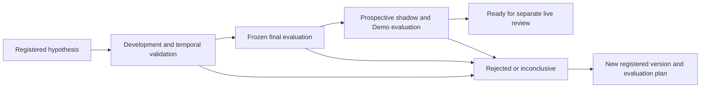
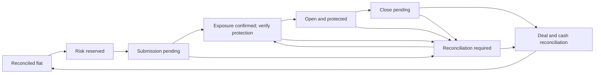

# Edge Discovery design review

Reviewed 10 September 2026 against checkout `4cd39e3` and the operator-supplied 22-section brief. **Design review only. No EdgeDiscoveryEngine, migration, runtime change, contract amendment or trading activation was implemented.**

Supporting documents: [repository findings and work packages](../../Research/2026-09-10-live-forex-readiness-review.md), [M0–M32 disposition](../../Research/2026-09-10-milestone-relevance.md), and [verified literature sources](../../Research/2026-09-10-fx-literature-source-review.md).

## Recommendation and gates

Adopt the proposal's scientific discipline, with a substantially smaller implementation. Extend existing Python research functions, the T480 executor and PostgreSQL lineage. First make the tested strategy match the executable strategy and establish trustworthy costs. Then test a very small, registered family. Advanced diagnostics cannot compensate for invalid timestamps, incomplete charges or a different backtested policy.

These are **review assessments**, not the repository's formal Triad/domain approval or milestone closeout:

| Gate | Assessment | Meaning |
| --- | --- | --- |
| RESEARCH_GATE | PASS_WITH_CONDITIONS | Appropriate principles; select a specific inferential protocol before implementation. The supplied eight links represent five studies. Published effects remain hypotheses for this broker and instrument. |
| DATA_READINESS_GATE | FAIL for confirming a trading edge | Useful engineering inputs exist. The inspected history, replay equivalence, time semantics and cost coverage do not support the proposed edge claims. This does not prevent repairing data collection or constructing the research pipeline. |
| ARCHITECTURE_GATE | PASS_WITH_CONDITIONS for the reduced design below | Reuse the existing stack; separate research evidence, operating permission and order state. Do not create thirteen parallel Edge milestones. |

The next implementation activity remains **active Wave 1, especially W1.4's reproduced risk-latch defect**. The architecture assessment does not authorise starting a later milestone or removing the Live prohibition.

## Correct the brief's starting assumptions

- `config/market_data.yaml` names M15 as primary, but the [actual T480 runner](../../t480/m20_demo_trading_session.py) executes five M1 heuristics. M5/H1 are shadow context. A nine-timeframe executable pipeline was not established by this inspection.
- MT5 Demo execution already exists. M20 is `NEEDS_FIX`; its existence is not completed operational proof or profitability evidence.
- The five strategies share inputs, overlap and have fixed selection precedence. Their current “regime” is largely the selected strategy's label, not an independent market measurement.
- Historical replay components exist, but [M16 evaluation](../../src/forex/walk_forward.py) and [domain proposal logic](../../src/forex/demo_trading.py) implement policies different from the runner. The retained M16 evaluation contains only twelve evaluated sessions and negative mean net results for both trading comparators under its assumptions.
- PostgreSQL, audit records and lineage already exist. Shared host transport belongs to `cs-ai-lab-infra`; a new research service should not take ownership of it.
- Treat `$10ADay` as an aspiration. A daily income quota would encourage trading when no supported opportunity exists. Report net income, uncertainty and operator effort over an appropriate interval, including days with no trades.

## Review of sections 1–22

“Keep” means retain the design principle, not that the capability already passes verification. Source labels S1–S12 refer to the [literature review](../../Research/2026-09-10-fx-literature-source-review.md). Implementation choices below are architectural inferences; candidate filters are project hypotheses.

| Section | Decision | Required correction or simplification |
| --- | --- | --- |
| 1. Definition of edge | Keep | Distinguish predictive accuracy, historical economic support and current operating permission. Include attainable lot sizes, capital usage, recurring expenses and pause behaviour. No status means a permanent edge or guaranteed income. |
| 2. Search risk | Keep, MVP | Register unsuccessful, abandoned and failed trials before execution, including manually proposed filters and exit changes. Previously unrecorded experimentation remains an explicit limitation; a fresh registry cannot erase it. |
| 3. Literature | Keep | Preserve primary-source links, inspected version, costs, market, horizon and limitations. S7 excludes trading costs; S8 includes estimated costs. Neither validates current EURUSD M1 execution. |
| 4. Initial search | Narrow further | Five strategies × three regimes × three sessions × three volatility buckets × two directions already gives 270 cells before parameter choices. Retain the deployed composite as a baseline and initially allow at most two new confirmatory hypotheses. Exploratory cells consume the search budget and cannot be relabelled pre-specified. |
| 5. Economic gate | Keep, MVP | Evaluate complete trade outcomes and calendar equity, including rejected/unknown observations and costs. The current TP cost-coverage calculation is not expectancy. Use the actual risk/exit policy and operator economics, not win rate alone. |
| 6. Evidence sufficiency | Keep, MVP | Report dependence, effective information, time coverage and uncertainty. Neither 100 trades nor the current twelve sessions automatically qualifies an edge. Insufficient precision produces `INCONCLUSIVE`, not permission to keep sampling until a pass appears. |
| 7. Registries | Reuse and extend, MVP | Extend M19 lineage and M20 signal records with experiment/family and trial records. Preserve every candidate's aligned returns in artifacts; do not create multiple registry services. |
| 8. Multiple testing | Keep, MVP before confirmatory claims | Choose one justified family procedure, such as White's Reality Check or SPA, with an explicit benchmark and dependence-aware resampling. Include the actual searched family, including cost-rejected variants. A family rejection alone does not identify an individually validated winner. See S1 and the SPA access limitation. |
| 9. Sharpe inference | Split | Raw Sharpe is descriptive when a suitable calendar return series exists. Defer PSR/DSR as additional diagnostics until trial history and sample quality justify them. Do not annualise correlated signal rows as independent returns or describe DSR as a persistence probability. See S9. |
| 10. PBO/CSCV | Later | Preserve aligned returns now. PBO concerns selection-related relative OOS ranking, not simply losing money. CSCV is not CPCV and does not replace chronological deployment evidence. A favourable score from an inadequate or uniformly losing family proves little. See S10. |
| 11. Temporal stages | Simplify, MVP | Use development with internal chronological validation, a frozen final holdout, then prospective observation. Walk-forward may be the development evaluation method; do not invent several “independent” stages that reuse the same dates. Retuning after final evaluation consumes that holdout. |
| 12. Financial cross-validation | Keep essentials, MVP | Enforce information availability, forward-only fitting and non-overlapping evaluation boundaries. Purge training labels crossing a test boundary; choose any additional gap from actual information/outcome spans. If both stop and target fall inside one OHLC bar, require finer executable-price data or an explicit conservative/ambiguous result; never assume the favourable sequence. Defer CPCV and arbitrary embargo percentages. |
| 13. Cost model | Reuse ledger, strengthen now | Version executable bid/ask conventions, commission, signed slippage, financing, conversion and latency assumptions. Keep observed broker net separate from modelled attribution. Missing exit references are unknown, not zero; never subtract estimated spread twice from actual fill P&L. |
| 14. Cost stress | Keep, MVP | Predeclare base, +50% and 2× variable execution-cost scenarios as engineering sensitivity checks, not universal academic thresholds. Stress the cost increment and execution path, not all net P&L. Include gaps, unavailable quotes and stop behaviour where data permits. |
| 15. Parameter stability | Small development check | Test a predeclared limited neighbourhood only on development data and count those trials. A broad plateau is useful sensitivity evidence, not proof. Do not use neighbourhood tests to select another winner on final holdout. |
| 16. Conditional edge | Keep, restrict dimensions | Replace circular strategy-derived regimes with observable features independent of the chosen action. Fit volatility cutoffs on past/development data. Historical smoothed regime labels or recomputed full-sample percentiles can leak future information. Report conditional cells descriptively until supported. |
| 17. Decay | Keep, staged | Separate immediate deterministic risk/data pauses from noisy estimates of economic deterioration. Predeclare review dates and downgrade rules; repeated statistical monitoring needs a sequential or repeated-testing policy. Do not optimise the strategy after every losing streak. |
| 18. Candidate model | Simplify | Make a candidate a view over a frozen hypothesis, evaluation artifacts and review events. Avoid a wide row full of nullable statistical scores. Store metric definition, interval, denominator, missingness and version alongside each result. |
| 19. Lifecycle | Simplify | Separate research stage, evidence assessment and execution eligibility. `INSUFFICIENT_EVIDENCE` is an assessment; `FORWARD_DEMO` is a stage; `RISK_PAUSED` is operating authority. Keep immutable transitions and rejection history. |
| 20. Sentiment | Later, conditional research | First prove the price/cost pipeline. Then test one incremental ablation with source availability and model versions. A modern LLM may know historical outcomes, so historical news prompts alone do not establish leakage-free sentiment. Prospective capture is preferable. Charge AI expense to incremental value. |
| 21. Analyst agent | Read-only initially | Provide verified evidence and current observations. Explanations may be useful; statistical status and capital authority remain deterministic. An agent veto that changes executed trades is itself a new trading policy requiring evaluation, even if labelled “only a safety filter.” |
| 22. Implementation gates | Merge into existing waves | Do not add EDGE-M0–M12 as another roadmap. Repair W1, make measurement/replay honest in W2, and conduct frozen economic research in W3. A later Live pilot needs a separate contract and authority. Architecture approval alone is not data readiness or profitability. |

## Answers to the 22 repository questions

| Question | Finding |
| --- | --- |
| Q1. Already implemented? | Snapshots, five deterministic signal rows, selection, proposals/reservations, broker reconciliation, risk policy, historical alignment and model lineage. Quality and proof differ by component. |
| Q2. Reusable components? | Existing Python modules, M19 provenance, PostgreSQL migrations, M20 audit/ledger, fixed MT5 adapter and T480 task. |
| Q3. Duplications? | A second risk engine, intent orchestrator, provenance service or independent backtest policy would duplicate existing responsibilities. |
| Q4. Appropriate now? | Descriptive net outcomes, clock/leakage checks, coverage and uncertainty reporting. Do not infer significance from the inspected tiny sample. |
| Q5. Premature? | PBO/CPCV, large regime grids, neural regime discovery and sentiment optimisation. DSR is optional later. |
| Q6. Five strategies testable? | The rule functions are extractable, but signals alone omit executable sizing, selection and full exit state. Freeze those together. |
| Q7. Signals/outcomes sufficient? | Useful signal snapshots exist. Only the executed owner has a broker outcome; alternative policies need independent simulated accounts. |
| Q8. Lookahead prevented? | Not established end to end. M6's retained closed-time inconsistency and different replay policy require qualification. |
| Q9. All trials represented? | PostgreSQL can support it; the current application schema does not register the full research family/search history. |
| Q10. Costs sufficient? | Actual fee-complete reconciliation is reusable. Forecasts and reference-price attribution remain incomplete. |
| Q11. Regime available? | Labels exist; the execution selector's labels are unsuitable as independent conditioning evidence. |
| Q12. Session available? | UTC-hour rules exist. Add explicit London/New York calendar and DST semantics for the selected hypothesis. |
| Q13. Volatility state available? | Price ranges exist, but the entry flag is a spread check. No qualified research volatility-bucket pipeline was established. |
| Q14. Collect now? | Time-qualified bars, bounded bid/ask observations, symbol/account cost terms, decision-time inputs, submissions/fills, events, gaps and all candidate outputs. Retention changes need the current contract amended first. |
| Q15. Necessary architecture? | Shared pure policy kernel, versioned costs/data, small trial register, explicit transitions and account-bound risk/execution state. |
| Q16. Avoid? | New graph database, microservices, nine-timeframe search, always-on LLM decisions and multiple autonomous order writers. |
| Q17. Smallest useful MVP? | One reproducible command comparing a frozen baseline and small declared family under realistic costs, with immutable artifacts and an honest supported/rejected/inconclusive report. |
| Q18. MVP methods? | Chronological validation, correct availability, dependence-aware uncertainty, complete search accounting, one justified family test and cost sensitivity. |
| Q19. Later methods? | DSR/PSR, PBO/CSCV, CPCV or richer regimes only when enough data and a specific research question justify them. |
| Q20. Biggest statistical risks? | Wrong policy under test, time leakage, cost omissions, correlated selection, repeated holdout use, sparse conditional cells and post-hoc stopping. |
| Q21. Analyst input? | Frozen strategy/version, applicable sample and dates, net result/uncertainty, coverage, cost stress, evidence status, current context freshness and independent risk state. |
| Q22. Next implementation? | W1.4 persistent risk-latch repair plus remaining W1 evidence. Next research foundation is W2; do not start a new Edge milestone during this review. |

## Smallest useful architecture

Use one Python library/CLI in this repository, not a new deployed service. A pure policy kernel takes immutable observations and explicit position/risk state and returns a decision. Replay and T480 call it. Broker I/O, persistence and scheduling remain outside the kernel. Extraction must preserve current behaviour; research changes get separate versions.

Extend existing persistence with two logical record types; physical table names and migrations belong to later implementation:

1. **Experiment/family:** hypothesis, origin and parent, complete rules/exit policy, declared candidate family, benchmark, capital/risk/cost basis, development/final/prospective intervals, search and compute limits, registration time and protocol hash. “Pre-registered” must be supported by registration before evaluation, not a manually editable flag.
2. **Trial:** durable `STARTED` event before evaluation; input/code/config/data/cost hashes; seed and dependency versions; success/failure/cancellation events; artifact paths/hashes; aligned calendar equity/returns and coverage. Keep all variants and independent state paths, including no-trade periods and unresolved observations.

Reuse append-only evidence/review events for decisions. A candidate view references those records rather than copying metrics and allowing them to drift. Store raw observations, analysis outputs and independent verification separately. A crash must leave a visible unfinished trial; retry links to it rather than concealing the attempt.

One report command should rebuild the economic verdict from retained artifacts. Predeclare a net benchmark, effect size worth detecting, evaluation dates, dependence treatment and selection method before inspecting final outcomes. Report `INCONCLUSIVE` when precision or cost coverage is inadequate. An extension requires a new recorded protocol and must not quietly reuse a consumed holdout.

The policy's marked-to-market returns must include the actual position cap and risk pauses. Attribute recurring data, infrastructure and AI costs once at operator level. A positive per-trade estimate can still fail the business case because turnover is low, minimum lots are infeasible or fixed expenses exceed profits. Detailed success criteria and real-world demonstrations are [A1–A12](../../Research/2026-09-10-live-forex-readiness-review.md#proposed-changes-success-and-demonstrations).

## Autonomous work and boundaries

Most continuous work should be ordinary deterministic software. The operator should approve a bounded operating mandate, then receive exceptions and periodic economic summaries. A Codex conversation is not the production scheduler.

| Worker | Useful autonomy | Boundary |
| --- | --- | --- |
| Collector/data validator | Capture approved observations; validate freshness, time and coverage on arrival. | No source expansion or silent repair of captured evidence; record gaps. |
| Executor and risk controller | Execute a frozen authorised policy, reconcile orders and manage protection. | One account-level entry writer; no strategy/risk changes. New entries require all independent risk latches clear. |
| Reconciler | Resolve broker order/deal/position history and reconcile net cash movements. | An ambiguous acknowledgement blocks resubmission. Unknown does not mean flat. Unexplained cash flow needs its approved review. |
| Watchdog | Observe health externally, perform bounded safe restarts and retain incidents. | Preserve maintenance/risk holds and known exposure. Restarting a process must not reauthorise trading or close positions by default. |
| Research runner | Execute a registered finite job and generate its report. | Fixed data/search/compute limits; no recursive optimisation or unlimited sampling until significant. Research load must not starve execution on T480. |
| Research LLM | Periodic literature triage and a small number of proposed experiments. | Read-only sources/results; cannot submit orders, alter trials or self-promote a candidate. Record model/version and attributable costs. |
| Analyst/reporting LLM | Explain verified findings and exceptions in a concise operator report. | No fabricated confidence, changed statistical verdict or risk override. Missing LLM service should not break protection or reconciliation. |

Set configurable call/compute limits, schedules, timeouts and retry limits before enabling LLM jobs. Prefer an event-triggered or periodic summary to per-tick calls. A local model still consumes T480 resources; include that load and any API charges in the operating budget. No ongoing agent subscriptions or host changes were made here.

## State: use graphs as specifications, not a new database

**Yes, explicit state-transition graphs help. PostgreSQL and the existing event history can store the state.** A graph database, knowledge graph or LangGraph runtime is unnecessary for these bounded flows.

Keep four independent dimensions visible: service health, research evidence, entry authority and broker lifecycle. Include account/server, configuration/release version, observed-at time, unresolved exposure and every active pause reason in a compact status view. `RUNNING` must not imply data freshness, entry permission or completed evidence.

Research flow, proposed rather than implemented:

The final node grants no order permission. A separate human-approved Live contract is required. Freeze a prospective shadow version before observing outcomes, and subsequently qualify actual execution of the selected candidate. Shadow estimates alone are not broker evidence.

Illustrative order flow, to refine against the actual broker contract:

Partial fills retain their actual volume and unresolved remainder through these states; a timeout or cancel request is not proof that no fill occurred. Reject/cancel transitions return to flat only after the broker facts and reservation are reconciled. Protection failure uses the contract's predefined remediation and blocks further entries. A risk pause inhibits entries while necessary protection, exits and reconciliation continue.

Broker observations establish what happened; application records establish ownership, intent and authority. Use stable identifiers and account-level serialization, and reconcile uncertain outcomes. Local idempotency alone cannot promise exactly-once execution across the database and broker. Separate risk latches are essential: a daily reset cannot clear a historical drawdown or weekly incident.

## Wave integration and acceptance

| Wave | Narrow outcome | Success demonstration |
| --- | --- | --- |
| W1, active | Trustworthy Demo lifecycle, fee reconciliation, persistent risk and unattended recovery. | Reproduce and repair the risk-latch failure, then obtain the existing contract's required real Demo and restart evidence with independent verification. |
| W2 | Honest eligibility/cost observations and shared executable replay. | Qualify real timestamps/cost inputs; replay retained broker decisions with explained parity; refuse missing/stale conditions, including just before submission. |
| W3 | Registered, reproducible economic evaluation of a small frozen family. | Complete untouched evaluation and prospective evidence with realistic costs, risk pauses, uncertainty and operator expense. An honest rejection is a valid research result. |
| Later Live proposal | One supported candidate under explicit account/capital authority. | A separately authorised tiny funded pilot verifies actual Live fills, costs and operating effort. Passing Demo does not prove Live economics. |

Keep existing milestone records and map superseded criteria explicitly; do not delete historical evidence or mark duplicates complete by description. Defer the proposed standalone sentiment and advanced-statistics milestones. See the [full milestone map](../../Research/2026-09-10-milestone-relevance.md).

The review used current source inspection, retained evidence, primary literature, existing tests and a local behavioural risk probe. It did not capture fresh broker proof or certify the current T480 session. No implementation was executed.

RECOMMENDED_ARCHITECTURE: existing Python/PostgreSQL/T480 stack; one shared policy kernel; a small append-only experiment/trial extension; versioned costs and temporal evaluation; explicit state transitions; deterministic execution/risk; bounded read-only LLM assistance.
