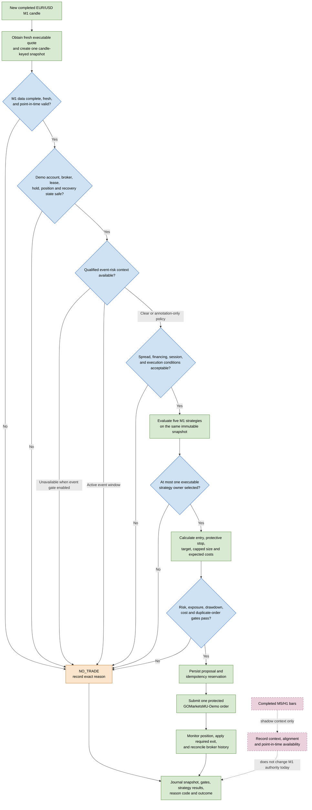

# M1 hybrid decision flow

This diagram is the proposed target shape for the EUR/USD M1 Demo workflow.
It combines the current repository's decision provenance, fixed Demo execution,
and reconciliation controls with a candle-keyed decision cadence and qualified
event-risk handling. It is not a claim of profitability and does not itself
change the running listener.

## Status key

- Green: current implementation direction; individual gates may still have
  documented limitations.
- Blue: decision points that must return an explicit reason when refusing.
- Orange: normal safe refusal outcome.
- Purple dashed: currently shadow-only context. M5/H1 cannot create, veto, or
  own an M1 trade until separately authorised and tested.

The event decision is conditional by design. The current shipped event policy
is annotation-only; therefore it must not be represented as an active entry
veto until a qualified point-in-time event context is deployed. If it is
enabled later, unavailable or invalid required context must refuse a new entry.

See [M1 Demo decision workflow](m1-demo-decision-workflow.md) for current
behaviour and [M1 decision-workflow end-state review](../reviews/m1-decision-workflow-end-state.md)
for the target capability, gaps, and promotion criteria.
